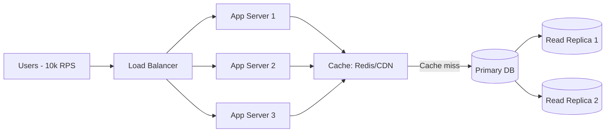

## Scalability vs Performance

### Performance
- **Latency**: how long it takes to handle a request (p95, p99).
- **Throughput**: how many requests per second (RPS) the system can handle.
- Example: A payment API responds in 100ms (latency) and processes 500 RPS (throughput).

### Scalability
- Ability of a system to **maintain or improve performance as load increases**.
- Two strategies:
  - **Vertical scaling**: add more CPU/RAM to a single machine.
  - **Horizontal scaling**: add more machines/instances and distribute traffic.
- Example: Disney+ grows from 1M to 10M active users → a scalable system keeps latency <200ms under 10x more load.

---

## Example Scenario

Flight Search Service:
- 1 server → 100 RPS, p95 latency = 150ms.
- Load doubles to 200 RPS:
  - If latency degrades to 600ms → system is **not scalable**.
  - If add 2 servers + load balancer and latency remains ~150ms → system **is scalable** (horizontal scaling works).

---

## Key Trade-offs
- **Vertical scaling** → simpler to implement but limited by hardware.
- **Horizontal scaling** → more powerful but requires distributed coordination (load balancers, consistency).

---

## Interview Question Practice

**Q:** What’s the difference between performance and scalability?  
**A:**  
Performance is about how fast the system is at a given load (latency + throughput).  
Scalability is about how the system behaves as the load increases — whether it maintains performance when we add more resources.  
Example: scaling a service horizontally with load balancers allows us to handle more users without degrading latency.

## Exercises
### 1. Compare strong vs eventual consistency on a read-heavy API
**Context:** Read-heavy API (e.g., product catalog, read/search endpoints).
#### Strong Consistency
- **Pros**
  - Reads always see the latest committed write.
  - Simpler reasoning for clients (fewer anomalies).
  - Good fit for critical invariants (e.g., balances, entitlement checks).
- **Cons**
  - Higher latency: reads often need quorum/leader, cross-AZ round trips.
  - Lower availability under partitions (CP in CAP).
  - Throughput may be lower (coordination, locks, leader bottlenecks).

**Typical implementations**
- Primary/leader + synchronous replication (quorum reads/writes).
- Linearizable KV (e.g., etcd, Consul, strongly consistent Postgres with sync replicas).

#### Eventual Consistency
- **Pros**
  - Lower latency reads (serve from closest replica or cache).
  - Higher availability under partitions (AP in CAP).
  - Better horizontal scalability (replicas scale read QPS).
- **Cons**
  - Clients can observe stale data; anomalies like non-monotonic reads.
  - Write conflicts require resolution (LWW, CRDTs, app logic).
  - Harder reasoning for “read-after-write” guarantees.

**Typical implementations**
- Dynamo-style stores (Cassandra/DynamoDB eventual), read from local replica or cache.
- Async replication + caches (Redis/edge/CDN).

#### Decision for a Read-Heavy API
- Default to **eventual consistency** for **non-critical reads** (catalog, search, timelines) with:
  - Cache-aside (Redis/edge), TTLs, background warm-up.
  - **Session/Monotonic reads** for better UX (sticky reads to same replica).
  - **Read-your-writes** per session where needed (route to leader after a write).
- Use **strong consistency** only for **critical** checks on read paths (e.g., entitlement, access control, idempotency validation), or isolate those reads to a smaller strongly consistent service.

**Cheat matrix**

| Requirement                             | Strong | Eventual |
|-----------------------------------------|:------:|:--------:|
| Must never show stale data              |   ✅   |    ❌    |
| Sub-200ms global reads at scale         |   ⚠️    |    ✅    |
| Survive partitions with degraded UX     |   ❌   |    ✅    |
| Simple client reasoning                 |   ✅   |    ⚠️     |
| Read throughput (cheap scale-out)       |   ⚠️    |    ✅    |
| Scenarios and usercases                 |   Banks, tickets  |    Catalogs, feeds     |

---

### 2. Capacity plan for 10k RPS, p95 < 200ms

**Step 1 — Concurrency (Little’s Law)**  
N ≈ λ × W  

- λ = arrival rate = 10,000 requests/second  
- W = average response time = 0.1s (100ms target to keep p95 under 200ms)  
- N ≈ 10,000 × 0.1 = 1,000 concurrent requests in flight  
- Add 30–50% headroom → plan for ~1,500 concurrent requests.

---

**Step 2 — Instance capacity & autoscaling**  
- Suppose 1 app instance (4 vCPU, 8 GB) can handle ~600 RPS at 70% CPU.  
- Required instances: 10,000 / 600 ≈ 17 → round to 20 for headroom.  
- Autoscaling: min 12, desired 20, max 40. Trigger scale-up if p95 > 180ms for >2 minutes.

---

**Step 3 — Load balancing & timeouts**  
- Use round-robin or least-connections load balancer.  
- Request timeout: 300–500ms end-to-end.  
- Per-hop timeouts smaller (e.g., 100–150ms) to protect SLA.  
- Retries only on idempotent calls, with jitter and retry budgets.

---

**Step 4 — Caching to reduce backend load**  
- Edge/CDN for static or semi-static GETs.  
- Redis cluster for hot keys, TTL 30–120s, cache-aside pattern.  
- Goal: ≥80% cache hit ratio → reduces DB load from 10k RPS to ~2k RPS.

---

**Step 5 — Database/storage planning**  
- Effective DB QPS = 20% of 10k RPS = ~2,000 RPS.  
- With 4 read replicas, each handles ~500 RPS comfortably.  
- Use connection pooling and proper indexes.  
- Partitioning/sharding if dataset grows beyond single-node limits.

---

**Step 6 — Dependencies & external calls**  
- Latency budget (example for p95 < 200ms):  
  - LB + TLS: 10–20ms  
  - App logic: 40–80ms  
  - Cache/DB: 30–60ms  
  - External APIs: ≤80ms, parallelize, return partial results if they timeout.  
- Circuit breakers and bulkheads to isolate failures.

---

**Step 7 — Observability & SLOs**  
- SLIs: p95/p99 latency, error rate, saturation (CPU, connections), cache hit ratio.  
- SLOs: p95 < 200ms for 99% of minutes, error rate <0.5%.  
- Dashboards: latency trends, error breakdowns, autoscaling events.

---

**Step 8 — Failure & chaos drills**  
- Canary releases with 5% traffic before full rollout.  
- Load tests at 1.2–1.5× target (12–15k RPS).  
- Chaos tests: inject latency and packet loss to validate timeouts and fallbacks.

---

**Summary sizing (initial estimate)**  
- **App tier**: 20 instances (autoscale 12–40).  
- **Cache**: Redis cluster sized for ~100k ops/s aggregate.  
- **DB**: 1 primary + 3–4 replicas (or partitioned), each <500 RPS.  
- **LB/CDN**: terminate TLS, distribute traffic globally.

