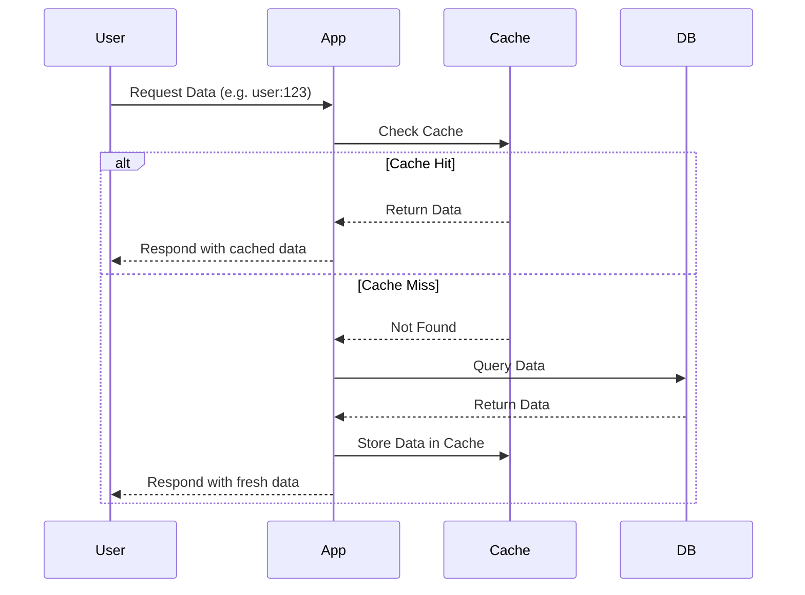

# Caching

## 1. Why Caching?
Caching stores data in a **faster storage layer** (memory or edge nodes) so repeated requests don’t hit the database or origin server.  
It reduces latency, saves costs, and increases throughput.

---

## 2. Cache Strategies

### Write-Through
- Every **write** goes to the **cache** and then to the **DB**.  
- Cache always in sync.  
- Higher write latency (two writes).  
- **Use case:** critical data like account balances.  

```text
Write → Cache → DB
```

---

### Write-Back (Write-Behind)
- Write goes to the **cache only**, DB updated asynchronously later.  
- Very fast writes.  
- Risk of data loss if cache fails before persisting.  
- **Use case:** analytics, metrics, logging.  

```text
Write → Cache → (later → DB)
```

---

### Write-Around
- Write goes **only to the DB**, cache filled on future reads.  
- Avoids polluting cache with rarely accessed data.  
- First read after write is slow (cache miss).  
- **Use case:** systems where many writes are not read immediately.  

```text
Write → DB
Read (miss) → Cache load
```

---

## 3. Cache Invalidation Techniques
Keeping cache fresh is hard. Strategies include:

- **TTL (Time To Live):** data expires automatically after X seconds.  
- **Explicit Invalidation:** application deletes/updates cache when data changes.  
- **Write-Through:** cache updated during writes.  
- **Cache-Aside (Lazy Loading):** application loads from DB on a cache miss, then updates cache.  

**Example:**  
- User updates profile → app invalidates `cache:user:123`.  
- Next read → fetched from DB and re-cached.

### Mermaid Diagram: Cache-Aside Flow



## 4. App-Level vs CDN Caches

### 🔹 App-Level Cache (Redis, Memcached)
- Close to the application.  
- Stores query results, sessions, computed values.  
- Example: Redis stores top 10 products query result.

### 🔹 CDN Cache (CloudFront, Akamai, Fastly)
- Edge nodes near the user.  
- Stores static content (images, videos, HTML).  
- Example: image loaded from Lima CloudFront edge instead of US origin.

👉 Best practice: **combine both**.  
- CDN → static content.  
- Redis/Memcached → dynamic data.

---

## 5. Real-World Examples

### 🛒 E-commerce
- Product page: HTML/images via **CDN cache**.  
- Product details from **Redis** (cache-aside).  

### 💳 Payments
- Balance queries → **write-through** to ensure consistency.  

### 📲 Social Media
- Timeline feeds cached in Redis.  
- Profile pictures and media cached at CDN edge.  

---

## 6. Interview Q&A

**Q1:** Explain caching strategies.  
**A1:** Write-through = consistency but slower writes. Write-back = fast writes but risk of data loss. Write-around = avoids unnecessary cache pollution but slower first read.  

**Q2:** How do you handle cache invalidation?  
**A2:** TTL, explicit invalidation, or cache-aside. Choice depends on data freshness needs.  

**Q3:** Redis vs CDN cache trade-offs?  
**A3:** Redis = app-level, dynamic, low-latency DB caching. CDN = static content, distributed globally. Both often used together.  

---

## 7. Key Takeaways
- Caching reduces latency and DB load.  
- Different write strategies balance consistency vs performance.  
- Invalidation is tricky; TTL and cache-aside are common.  
- Redis/Memcached handle dynamic data, CDN handles static/edge content.  