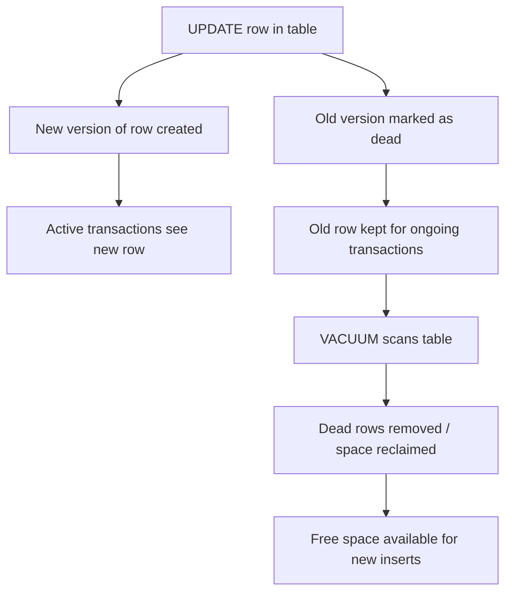
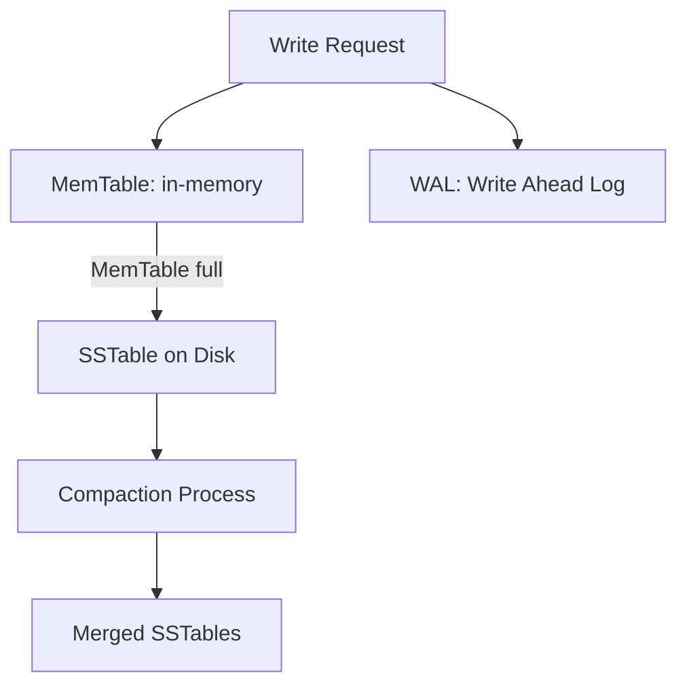

# Storage Engines & Log-Structured Systems

## 1. How Relational DBs (Postgres) Store Data

### Heap Storage
- Tables are stored as **heap files** (pages of 8KB each).
- Each row = a "tuple" inside a page.
- Updates create new row versions (MVCC).

### WAL (Write-Ahead Log)
- Every change is written to the WAL before going to the heap.
- Ensures **durability** (the "D" in ACID).
- WAL is sequential (fast to write).
- If crash → recover from WAL.
- **Checkpoints**: periodically flush WAL changes to heap.

Benefit: fast reads.  
Trade-off: updates create “bloat” → need `VACUUM` cleanup.

### VACUUM Cleanup in PostgreSQL

---

## 2. Log-Structured Merge Trees (LSM)

Used in **Cassandra, RocksDB, LevelDB**.  
Optimized for **high write throughput**.

### Flow:
1. Write goes to **MemTable** (in-memory).  
2. Also appended to **WAL** (durability).  
3. When MemTable is full → flushed to disk as **SSTable (Sorted String Table)**.  
4. Background **compaction** merges SSTables, removes duplicates/old versions.

### Benefits
- Sequential writes → very fast.  
- Scales well for heavy write workloads.

### Trade-offs
- Reads slower (may check multiple SSTables).  
- Needs Bloom filters + compaction to optimize.

### Mermaid Diagram: LSM Flow

---

## 3. Trade-offs: B-Tree vs LSM

| Aspect        | B-Tree (Postgres, MySQL) | LSM Tree (Cassandra, RocksDB) |
|---------------|---------------------------|--------------------------------|
| **Writes**    | Random I/O, slower        | Sequential, very fast          |
| **Reads**     | Fast, direct lookup       | Slower, multiple SSTables      |
| **Updates**   | In-place → bloat, needs VACUUM | Append-only → compaction      |
| **Workload**  | Best for read-heavy OLTP  | Best for write-heavy, time-series |
| **Use cases** | Banking, transactions     | Logging, IoT, analytics        |

---

## 4. Real-World Examples
- **Postgres/MySQL (B-Tree):** Banking, financial systems where reads are critical.  
- **Cassandra (LSM):** IoT, time-series, logging with millions of writes/sec.  
- **RocksDB:** Used by Facebook for Messenger and News Feed.  

---

## 5. Interview Q&A

**Q1:** Why does Postgres need a WAL?  
**A1:** To guarantee durability — logs are sequential and allow recovery after crashes.  

**Q2:** What is an SSTable?  
**A2:** A Sorted String Table — immutable file written by LSM engines, later compacted.  

**Q3:** Why are LSM trees better for writes?  
**A3:** Writes are sequential appends (fast for disks), not random seeks like B-Trees.  

**Q4:** What are trade-offs between B-Tree and LSM?  
**A4:** B-Tree → faster reads, but slower writes. LSM → faster writes, but more complex reads and compaction overhead.  

---

## 6. Key Takeaways
- Postgres/MySQL → B-Tree based, great for **reads + transactions**.  
- Cassandra/RocksDB → LSM based, great for **massive writes**.  
- WAL ensures durability in both approaches.  
- Trade-offs always depend on workload: read-heavy vs write-heavy.  