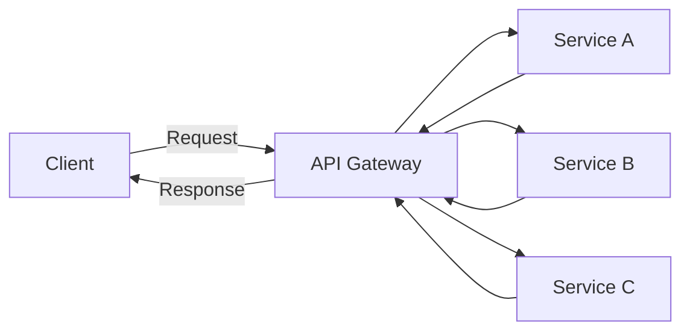
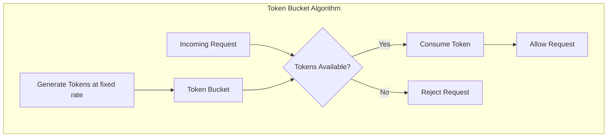
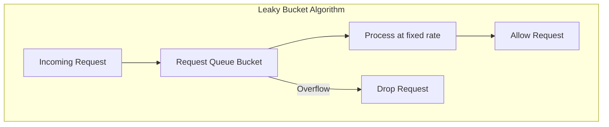
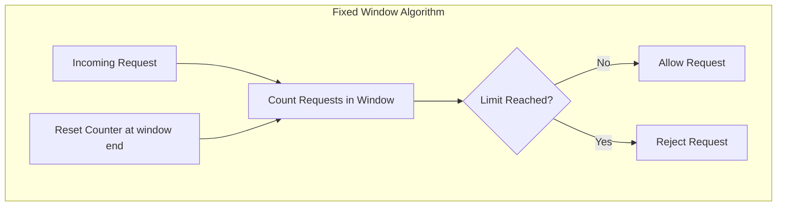
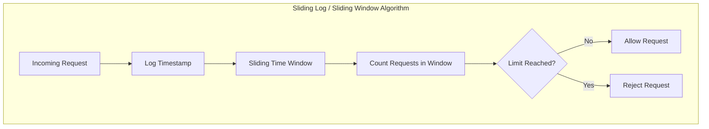
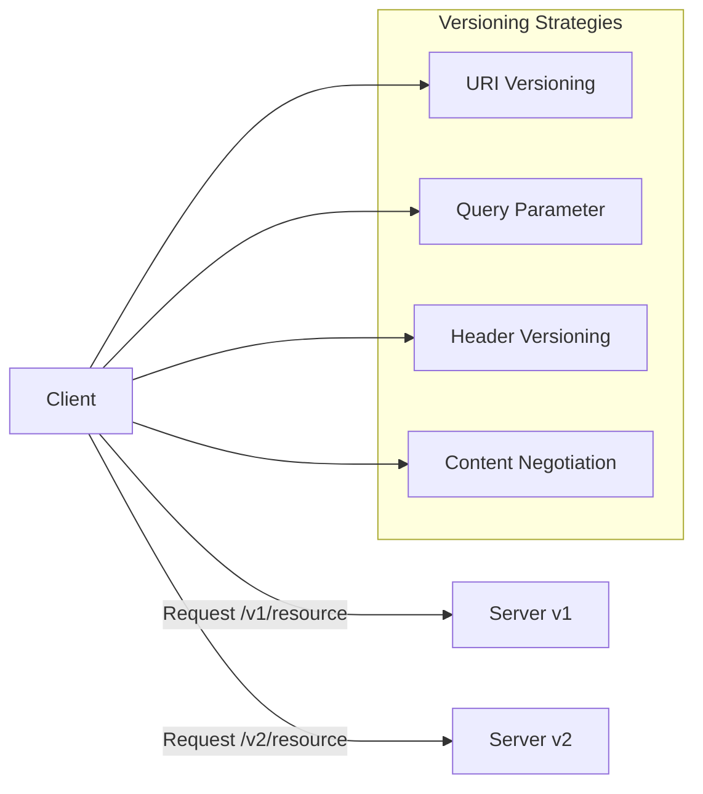

# API Design

## Table of Contents
- [REST vs gRPC vs GraphQL](#rest-vs-grpc-vs-graphql)
- [API Gateway Patterns](#api-gateway-patterns)
- [Rate Limiting & Throttling](#rate-limiting--throttling)
- [API Versioning & Backward Compatibility](#api-versioning--backward-compatibility)
- [Real-world Examples](#real-world-examples)
- [Interview Q&A](#interview-qa)
- [Key Takeaways](#key-takeaways)

---

## REST vs gRPC vs GraphQL

| Feature               | REST                          | gRPC                           | GraphQL                      |
|-----------------------|-------------------------------|--------------------------------|------------------------------|
| Protocol              | HTTP/1.1                      | HTTP/2                         | HTTP/1.1 or HTTP/2           |
| Data Format           | JSON, XML                    | Protocol Buffers (binary)      | JSON                        |
| Communication Style   | Request/Response             | Request/Response, Streaming    | Query-based                 |
| Performance           | Moderate                    | High (binary, multiplexing)    | Moderate                   |
| Schema                | No enforced schema           | Strongly typed with proto files| Strongly typed schema       |
| Flexibility           | Fixed endpoints              | Fixed methods                  | Flexible queries             |
| Caching               | Easy (HTTP caching)          | Complex                       | Complex                    |
| Tooling Support       | Excellent                   | Excellent                    | Growing                    |
| Use Cases             | Public APIs, CRUD apps       | Microservices, low latency    | Complex data fetching, frontend |

---

## API Gateway Patterns

An API Gateway acts as a single entry point for multiple backend services. It handles request routing, composition, and protocol translation.

### Common Patterns:
- **Request Routing:** Directs incoming requests to appropriate microservices.
- **Composition:** Aggregates results from multiple services.
- **Protocol Translation:** Translates between protocols (e.g., HTTP to gRPC).
- **Cross-cutting Concerns:** Authentication, rate limiting, caching, logging.

---

## Rate Limiting & Throttling

Rate limiting controls the number of requests a client can make to an API in a given time window. Throttling slows down or rejects requests that exceed limits.

### Common Algorithms:

- **Token Bucket:**
  - Tokens are added to a bucket at a fixed rate.
  - Each request consumes a token.
  - If tokens are exhausted, requests are rejected or delayed.

- **Leaky Bucket:**
  - Requests enter a queue (bucket) and are processed at a fixed rate.
  - Excess requests overflow and get dropped.

- **Fixed Window:**
  - Counts requests in fixed time windows.
  - Simple but can cause spikes at window edges.

- **Sliding Log / Sliding Window:**
  - Tracks timestamps of requests.
  - Provides more precise rate limiting.

---

## API Versioning & Backward Compatibility

Maintaining backward compatibility is critical to prevent breaking existing clients.

### Versioning Strategies:

- **URI Versioning:** `/v1/resource`
- **Query Parameter:** `/resource?version=1`
- **Header Versioning:** `Accept: application/vnd.myapi.v1+json`
- **Content Negotiation:** Using `Accept` and `Content-Type` headers

### Backward Compatibility Practices:

- Additive changes only (e.g., adding new fields)
- Deprecate but keep old versions alive
- Use feature flags
- Communicate deprecations clearly

---

## Real-world Examples

- **Twitter API:** Uses REST with versioning in URI.
- **Google APIs:** Use gRPC extensively for internal microservices.
- **GitHub GraphQL API:** Allows clients to query exactly what they need.
- **Netflix:** Uses API Gateway pattern to route requests to microservices.

---

## Interview Q&A

**Q1: What are the advantages of gRPC over REST?**

A1: gRPC offers better performance due to HTTP/2 and binary serialization, supports bi-directional streaming, and enforces a strongly typed schema via Protocol Buffers.

**Q2: How does an API Gateway improve microservice architecture?**

A2: It provides a unified entry point, handles cross-cutting concerns like authentication and rate limiting, and reduces complexity for clients by aggregating multiple service calls.

**Q3: Explain the Token Bucket algorithm.**

A3: Tokens are added to a bucket at a fixed rate. Each request consumes a token; if no tokens are available, the request is rejected or delayed, effectively controlling the request rate.

**Q4: How do you handle API versioning?**

A4: Common methods include URI versioning, query parameters, header versioning, and content negotiation. It's important to maintain backward compatibility and communicate changes.

---

## Key Takeaways

- Choose API style (REST, gRPC, GraphQL) based on use case needs.
- API Gateway centralizes routing and cross-cutting concerns.
- Implement rate limiting to protect your API and ensure fair usage.
- Version your APIs to maintain backward compatibility.
- Real-world APIs often combine multiple design patterns.
- Clear communication and documentation are critical for API consumers.

---
