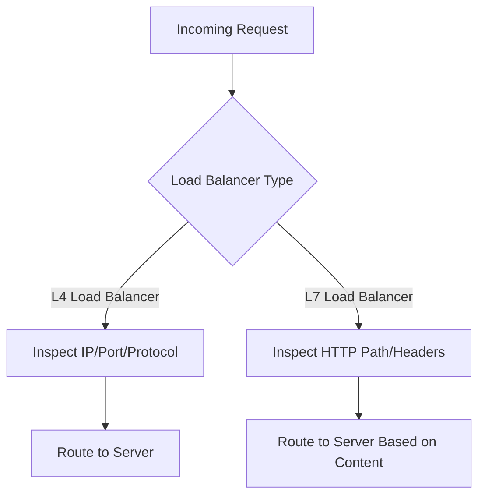
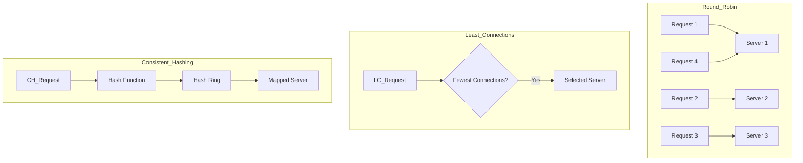
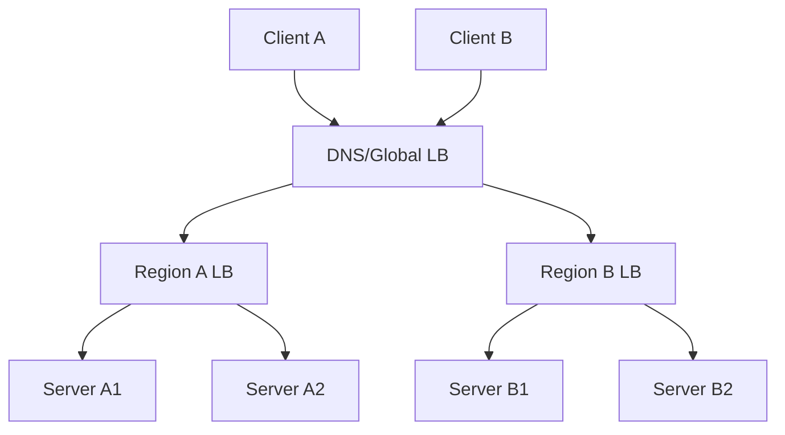
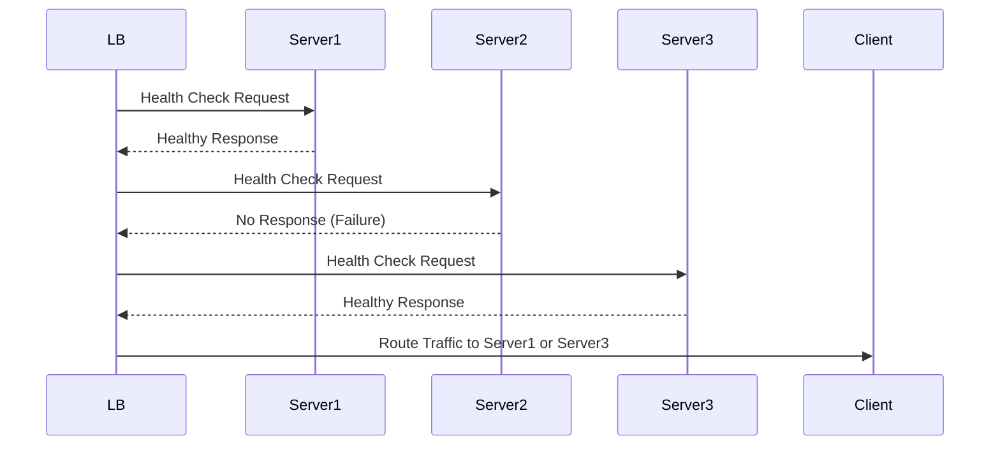

# Load Balancing

Load balancing is a fundamental concept in distributed systems and networking. It refers to the process of distributing incoming network traffic or computational workload across multiple servers or resources to ensure reliability, scalability, and high availability.

---

## L4 vs L7 Load Balancers

**L4 (Layer 4) Load Balancers**
- Operate at the transport layer (TCP/UDP).
- Make routing decisions based on IP address, TCP port, UDP port, and protocol.
- Examples: TCP proxy, NAT-based load balancing.
- Faster, less resource-intensive, but less flexible (cannot inspect HTTP headers or content).

**L7 (Layer 7) Load Balancers**
- Operate at the application layer (HTTP, HTTPS).
- Make routing decisions based on content of the message (URL path, HTTP headers, cookies).
- Can perform SSL termination, content-based routing, and more advanced policies.
- More flexible, but can introduce higher latency.

| Feature              | L4 Load Balancer    | L7 Load Balancer         |
|----------------------|--------------------|--------------------------|
| OSI Layer            | Transport (4)      | Application (7)          |
| Routing Basis        | IP/Port/Protocol   | HTTP headers/content     |
| Performance          | High               | Lower (more overhead)    |
| Features             | Basic routing      | Advanced, content-aware  |
| Example              | TCP/UDP proxy      | HTTP reverse proxy       |

---

## Load Balancing Algorithms

### 1. Round Robin
- Each new request is sent to the next server in a list, cycling through all servers.
- Simple to implement.
- Does not account for server load or capacity.

### 2. Least Connections
- Requests are sent to the server with the fewest active connections.
- Good for scenarios where requests have varying duration.
- More complex to implement; requires tracking connection counts.

### 3. Consistent Hashing
- Requests are distributed based on a hash of some property (e.g., client IP, session ID).
- Useful for sticky sessions or cache servers (minimizes cache misses when scaling up/down).
- Reduces the number of keys that need to be remapped when servers are added/removed.

**Other Algorithms:**
- Weighted Round Robin: Assigns weights to servers.
- Random: Selects a server at random.
- IP Hash: Uses client IP to determine the server.

---

## Global vs Local Load Balancing

**Local Load Balancing**
- Distributes traffic among servers within a single data center or region.
- Example: Load balancer in front of web servers in one AWS region.

**Global Load Balancing**
- Distributes traffic across multiple geographically distributed data centers or regions.
- Often uses DNS-based solutions or Anycast routing.
- Directs users to the nearest, healthiest, or least-loaded region.
- Handles disaster recovery and geo-failover.

---

## Health Checks and Failover

**Health Checks**
- Load balancers periodically check the health of backend servers (e.g., via HTTP, TCP, or custom scripts).
- If a server fails health checks, it is temporarily removed from the pool.

**Failover**
- If a server or entire region becomes unavailable, traffic is automatically rerouted to healthy servers or regions.
- Ensures high availability and minimizes downtime.

---

## Real-World Examples

- **NGINX, HAProxy:** Popular open-source load balancers (L4/L7).
- **AWS Elastic Load Balancer (ELB):** Managed L4/L7 load balancer.
- **Cloudflare, Akamai:** Provide global load balancing via Anycast and DNS.
- **Google Cloud Load Balancing:** Global, fully-distributed L7 load balancer.

---

## Interview Q&A

**Q: What is the difference between L4 and L7 load balancing?**
A: L4 load balancers operate at the transport layer and route traffic based on IP address and port, while L7 load balancers operate at the application layer and can make routing decisions based on content (e.g., URL, headers).

**Q: Why might you use a least-connections algorithm instead of round robin?**
A: Least-connections is better when requests have varying durations, as it helps prevent overloading a server with many long-lived connections.

**Q: How do health checks improve reliability in load balancing?**
A: Health checks ensure that traffic is only sent to healthy servers. If a server fails health checks, it is removed from the pool, which prevents user requests from failing.

**Q: What is consistent hashing and why is it useful?**
A: Consistent hashing distributes traffic based on a hash function, minimizing the number of remapped keys when servers are added or removed. It's especially useful for distributed caches.

**Q: What is global load balancing and when would you use it?**
A: Global load balancing distributes traffic across multiple regions or data centers, improving latency and availability for users worldwide.

---

## Key Takeaways

- Load balancing distributes traffic to improve scalability, reliability, and availability.
- L4 load balancers are fast and simple; L7 load balancers offer advanced, content-aware routing.
- Load balancing algorithms include round robin, least connections, consistent hashing, and more.
- Health checks and failover are essential for high availability.
- Global load balancing enables disaster recovery and geo-distribution.
- Real-world systems often combine multiple load balancing strategies for optimal performance.