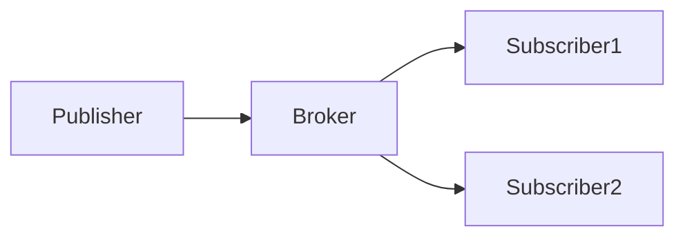
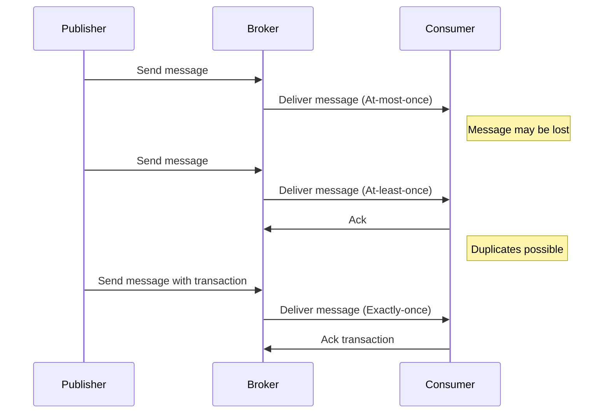
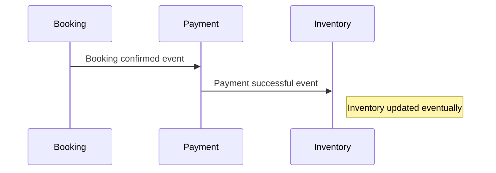
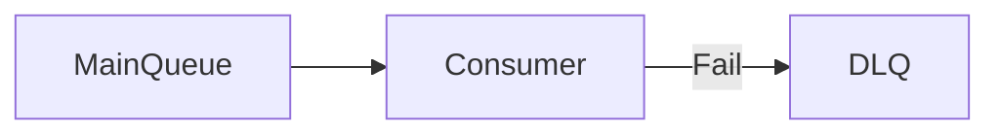

# Messaging & Event-Driven

## 1. Pub/Sub Pattern

The Publish/Subscribe (Pub/Sub) pattern is a messaging paradigm where publishers send messages to a broker without knowledge of the subscribers. Subscribers express interest in certain message topics and receive messages asynchronously through the broker, which decouples producers and consumers.

- **Publishers**: Components that emit messages/events.
- **Subscribers**: Components that consume messages/events.
- **Broker**: Middleware that routes messages from publishers to subscribers.

### Examples of Pub/Sub Systems

- **Kafka**: A distributed streaming platform designed for high-throughput, fault-tolerant pub/sub messaging with partitioned logs.
- **RabbitMQ**: A message broker implementing AMQP protocol, supporting complex routing and delivery patterns.
- **AWS SNS/SQS**: SNS (Simple Notification Service) is a pub/sub messaging service; SQS (Simple Queue Service) is a message queue used often alongside SNS for decoupling and buffering.

---

## 2. Delivery Semantics

Delivery semantics define guarantees about message delivery and processing:

- **At-most-once**: Messages are delivered zero or one time. No duplicates, but messages can be lost. Suitable for telemetry data where occasional loss is acceptable.
- **At-least-once**: Messages are delivered one or more times. No loss but possible duplicates. Common in payment systems where retries are necessary.
- **Exactly-once**: Messages are delivered once and only once. Hard to implement but critical for financial transactions. Kafka supports this with transactional APIs.

### Real-World Examples

- Telemetry data: At-most-once delivery to avoid overhead of retries.
- Payment processing: At-least-once to ensure payments aren't missed, with deduplication on the consumer side.
- Kafka transactions: Exactly-once semantics to guarantee atomic writes and reads.

---

## 3. Eventual Consistency

Eventual consistency means that distributed services update asynchronously and will converge to a consistent state over time. This is common in microservices architectures where immediate consistency is too costly or impossible.

### Example

In a booking system:
- Booking service reserves a slot.
- Payment service processes payment asynchronously.
- Inventory service updates availability after confirmation.

Each service processes events independently, and the overall system eventually reflects the correct state.

---

## 4. Dead-Letter Queues (DLQ)

A Dead-Letter Queue is a special queue used to store messages that cannot be processed successfully after several retries. DLQs help isolate problematic messages for later inspection or manual intervention.

### Example

If a payment message is malformed or causes processing errors repeatedly, it is moved to the DLQ instead of blocking the main queue.

---

## Real-World Examples

- **A Real world Project** uses Kafka for scalable event streaming to handle user activity and content recommendations.
- **A Real world Project** uses AWS SNS/SQS to manage reservation notifications and decouple services.
- **Stripe** uses webhooks with DLQs to handle failed event deliveries gracefully.

---

## Interview Q&A

- **Difference Kafka vs RabbitMQ?**  
  Kafka is a distributed log optimized for high-throughput streaming, RabbitMQ is a message broker with flexible routing and protocol support.

- **How to handle duplicates?**  
  Use idempotent consumers, deduplication caches, or Kafka's exactly-once semantics.

- **Why is exactly-once hard?**  
  It requires atomicity across distributed systems, handling failures, retries, and side effects without duplication or loss.

- **What is the role of DLQs?**  
  To isolate and handle poison messages that fail processing repeatedly.

- **Trade-offs of eventual consistency?**  
  Improved scalability and availability at the cost of temporary data inconsistencies and complexity.

---

## Key Takeaways

- Pub/Sub decouples systems enabling scalable, asynchronous communication.
- Delivery semantics define the reliability and guarantees of message delivery.
- Eventual consistency is a natural consequence of asynchronous distributed systems.
- Dead-Letter Queues increase system resilience by isolating problematic messages.