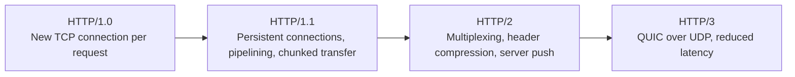
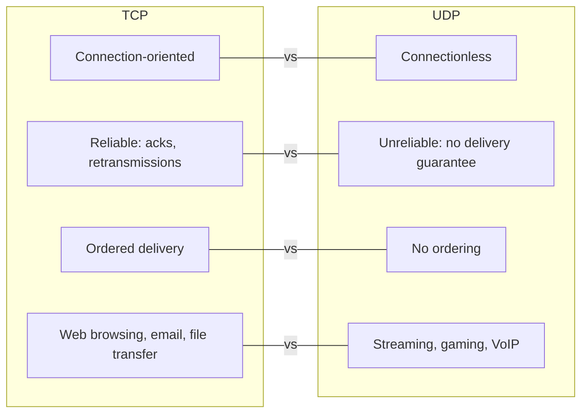
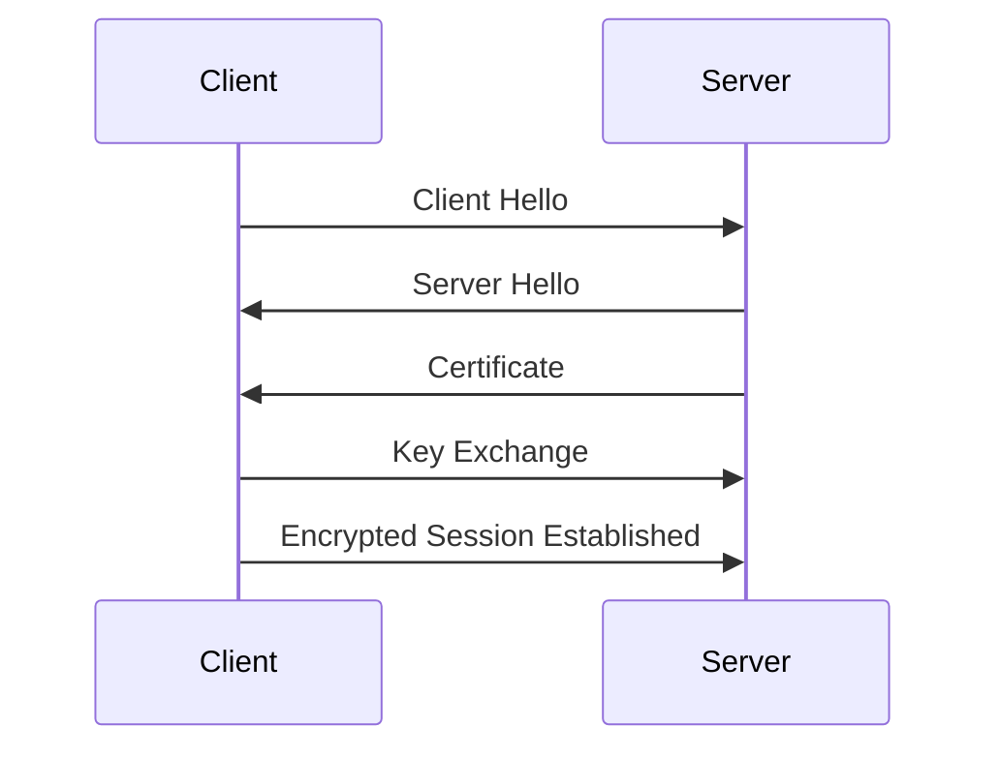
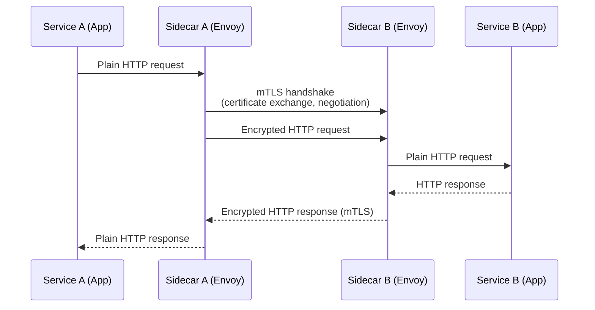
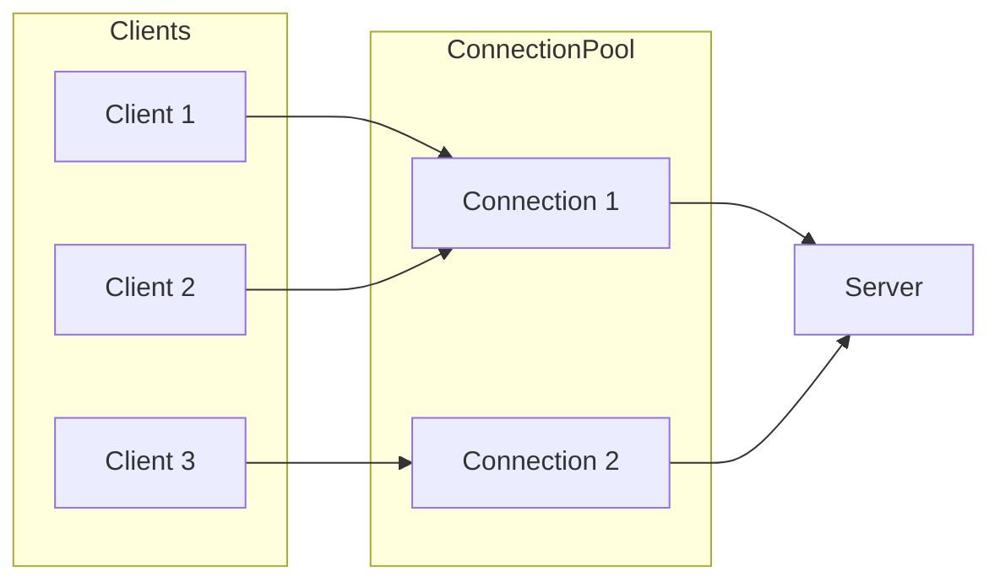

# Networking Basics

## HTTP Evolution

- **HTTP/1.0**: The original version of HTTP, which opened a new TCP connection for every request/response pair.
- **HTTP/1.1**: Introduced persistent connections (keep-alive), pipelining, chunked transfer encoding, and additional cache control mechanisms.
- **HTTP/2**: Multiplexing multiple requests over a single TCP connection, header compression (HPACK), and server push.
- **HTTP/3**: Uses QUIC protocol over UDP to reduce latency and improve connection setup times.

## TCP vs UDP

| Feature        | TCP                              | UDP                              |
|----------------|---------------------------------|---------------------------------|
| Connection     | Connection-oriented             | Connectionless                  |
| Reliability    | Reliable (acknowledgments, retransmissions) | Unreliable (no guarantee of delivery) |
| Ordering       | Ordered delivery                | No ordering                     |
| Use cases      | Web browsing, email, file transfer | Streaming, gaming, VoIP         |

## TLS/mTLS

- **TLS (Transport Layer Security)**: Provides encryption, integrity, and authentication for data in transit.
- **mTLS (Mutual TLS)**: Both client and server authenticate each other using certificates, enhancing security.

### mTLS with Service Mesh Sidecars (Microservices)

## Connection Pooling

- Reusing existing connections to reduce latency and resource consumption.
- Important for HTTP/1.1 and HTTP/2 to maintain performance under load.
- Connection pools manage lifecycle, health checks, and concurrency.

## Real-world Examples

- **Load Balancers**: Use connection pooling and TLS termination to efficiently handle traffic.
- **Microservices**: Often use mTLS for secure inter-service communication.
- **CDNs**: Utilize HTTP/2 and HTTP/3 features to optimize content delivery.

## Interview Q&A

**Q:** What are the main differences between HTTP/1.1 and HTTP/2?  
**A:** HTTP/2 supports multiplexing multiple requests over a single connection, header compression, and server push, improving performance over HTTP/1.1 which uses one request per connection or pipelining.

**Q:** Why would you choose UDP over TCP?  
**A:** For applications where low latency is critical and occasional packet loss is acceptable, such as live video streaming or online gaming.

**Q:** What is mTLS and why is it important?  
**A:** Mutual TLS requires both client and server to authenticate each other, providing stronger security guarantees than one-way TLS.

## Key Takeaways

- Understanding the evolution of HTTP helps optimize application performance.
- Choosing between TCP and UDP depends on the application's requirements for reliability and latency.
- TLS and mTLS are essential for securing data in transit.
- Connection pooling is a critical optimization technique in network programming.
