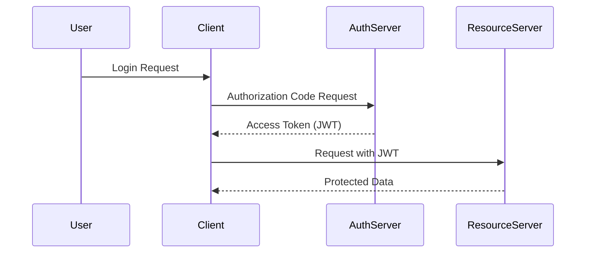
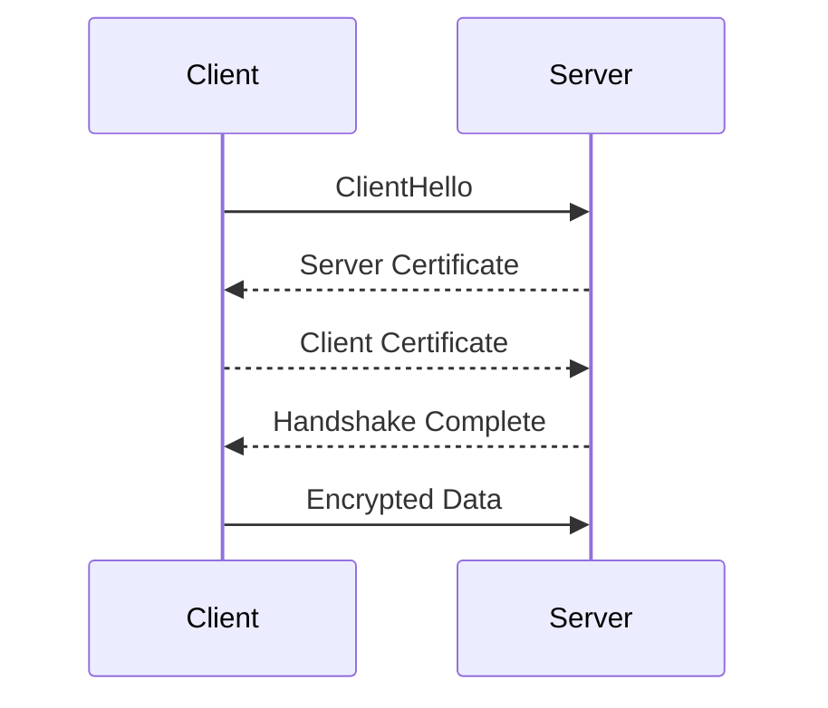
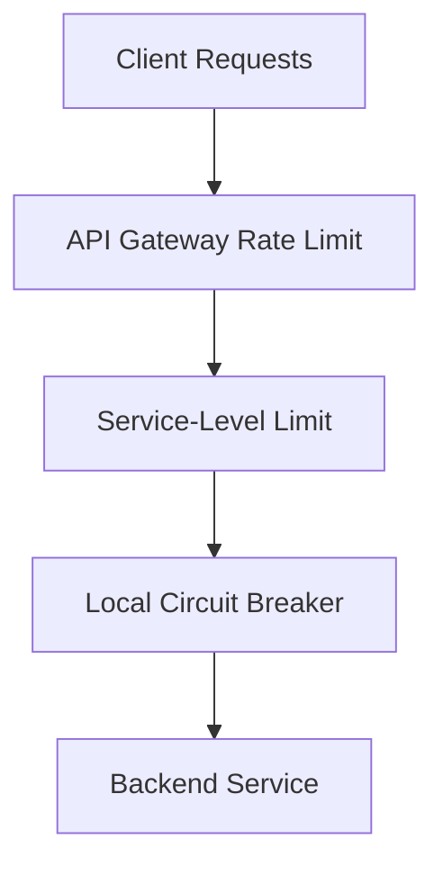
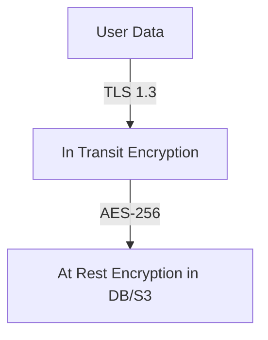

# Security in Distributed Systems

## 1. OAuth2, JWT, and API Keys

### OAuth2
OAuth2 is an authorization protocol that allows applications to access resources on behalf of users without sharing credentials.  
It defines multiple grant types:

| Flow | Description | Use Case |
|------|--------------|----------|
| Authorization Code | Uses a browser redirect and authorization server | Web or mobile apps |
| Client Credentials | Direct service-to-service access | Internal APIs or backend microservices |
| Device Code | Auth for devices without browsers | Smart TVs, consoles |
| Implicit | Legacy flow for browser-based apps | Deprecated |

**Example:**
A user logs into Disney+ using OAuth2. The identity provider issues a token that internal systems (like SWAN) use to authorize content access.

### JWT (JSON Web Token)
JWTs are self-contained tokens used by OAuth2 to convey claims.

Structure:  
`Header.Payload.Signature`

Example decoded payload:
```json
{
  "sub": "user123",
  "role": "admin",
  "exp": 1730000000
}
```

JWTs are **signed** (not encrypted), ensuring integrity but not confidentiality.  
They typically expire quickly (e.g., 15 minutes) and are refreshed via refresh tokens.

### API Keys
Simple static keys used for internal integrations or testing.  
Less secure than OAuth2 (no expiration, no scoping).  
Used in limited, controlled environments.

---

## 2. mTLS and Certificate Rotation

### mTLS (Mutual TLS)
Mutual TLS ensures **both** client and server authenticate each other using certificates.

**Flow:**
1. Client sends `ClientHello`
2. Server responds with its certificate
3. Client verifies the certificate
4. Client presents its own certificate
5. Both sides establish an encrypted session

**Example:**
 microservices running inside a Kubernetes cluster use mTLS via Envoy sidecars.  
Certificates rotate every 24 hours to avoid stale credentials.

### Certificate Rotation
Regular renewal of short-lived certificates prevents downtime or expired credentials.  
Handled automatically by service meshes (Istio, Linkerd) or AWS ACM.

---

## 3. DoS Protection with Rate Limiting

Denial of Service (DoS) attacks flood APIs with traffic, degrading performance.

**Protection Strategies:**
- **Rate Limiting:** Restrict request count per time window.  
- **Throttling:** Delay or queue requests above the limit.  
- **Circuit Breakers:** Reject requests when backend is overloaded.  
- **CDNs:** Offload static content and cache responses (CloudFront, Cloudflare).

**Example:**
Disney’s global API Gateway enforces 1000 RPS per key, while Envoy sidecars locally limit burst traffic.

---

## 4. Data Encryption: In Transit vs At Rest

| Type | Purpose | Example |
|-------|----------|----------|
| **In Transit** | Protects data during transmission | TLS 1.3, HTTPS, mTLS |
| **At Rest** | Protects stored data | AES-256, AWS KMS encryption |

**Example:**  
- SWAN APIs communicate via HTTPS (TLS 1.3).  
- Media metadata in S3 is encrypted at rest using AWS KMS-managed keys.

---

## Real-World Examples

- **Identity System:** OAuth2 + JWT-based user access.  
- **Internal APIs:** mTLS between microservices using Envoy.  
- **AWS Cloud Security:** Encryption at rest (S3, RDS) and in transit (TLS).  
- **DoS Protection:** Multi-layer rate limiting and WAF rules.

---

## 💬 Interview Q&A

**Q1.** What’s the difference between authentication and authorization?  
→ Authentication = verifying who you are. Authorization = what you can do.

**Q2.** Why use OAuth2 instead of API keys?  
→ OAuth2 provides short-lived, scoped, and revocable tokens.

**Q3.** What is mTLS and why is it important?  
→ mTLS enforces mutual trust between services in a zero-trust network.

**Q4.** How do you automate certificate rotation?  
→ Use service mesh (Istio/Envoy) or AWS ACM to manage short-lived certs.

**Q5.** How to defend APIs from DoS attacks?  
→ Rate limiting, throttling, circuit breakers, and CDN protection layers.

**Q6.** Why encrypt data at rest if the disk is secure?  
→ Defense in depth: protects backups and snapshots from leaks.

---

## ✅ Key Takeaways
- OAuth2 and JWT handle **authorization and token integrity**.  
- mTLS secures **microservice communication** with certificate-based trust.  
- DoS protection ensures **availability under attack**.  
- Encryption ensures **data confidentiality both in transit and at rest**.

---

## 🧩 Mermaid Diagrams

### OAuth2 Flow


### mTLS Handshake


### Rate Limiting Layers


### Encryption Layers


---