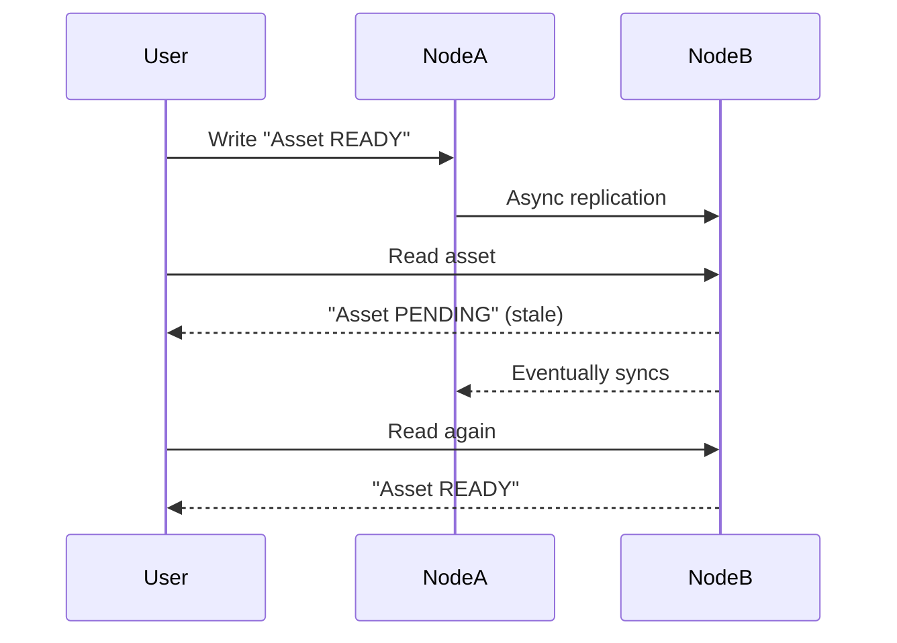
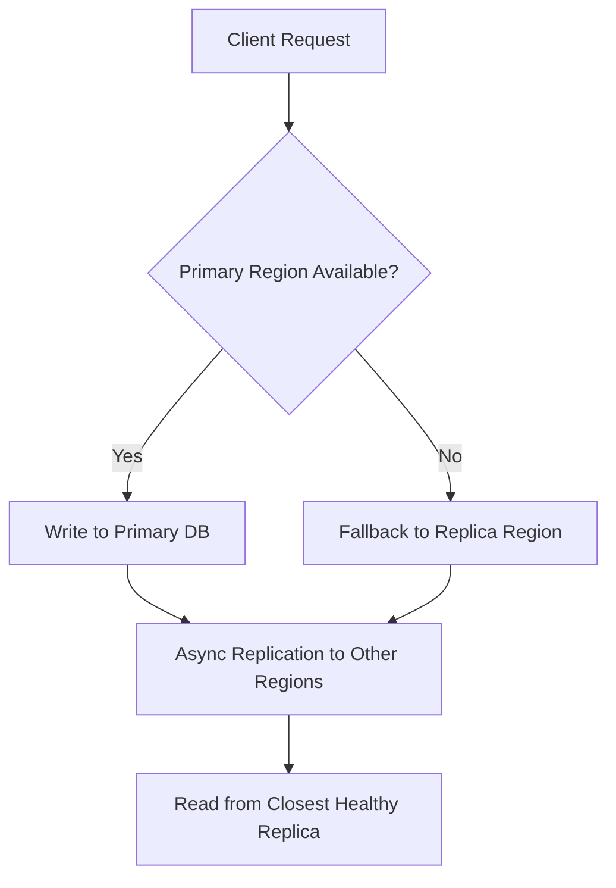

# Consistency, Availability & Fault Tolerance

## The CAP Theorem (Eric Brewer’s Theorem)

### Concept
In a distributed system, you can’t guarantee all three simultaneously:

| Property | Description |
|-----------|--------------|
| **C – Consistency** | All nodes see the same data at the same time. |
| **A – Availability** | Every request receives a response, even if stale. |
| **P – Partition Tolerance** | The system continues to operate despite network partitions. |

**CAP states:** Under a network partition (P), you must choose between **Consistency (C)** and **Availability (A)**.

---

### Real-World Mapping

| Category | System Type | Example |
|-----------|--------------|----------|
| **CP (Consistency + Partition Tolerance)** | Prioritizes data accuracy over uptime | Zookeeper, HBase, etcd |
| **AP (Availability + Partition Tolerance)** | Prioritizes uptime, may serve stale data | Cassandra, DynamoDB |
| **CA (Consistency + Availability)** | Only possible without partitions (single node) | Traditional RDBMS |

---

### Example Scenario
A **media state service** synchronizing Disney+ and Hulu assets experiences a partition.

we must choose between:
- **Consistency:** block reads until all replicas agree.
- **Availability:** return possibly stale asset data.

Possible Disney’s approach → **Eventual consistency (AP)**, prioritizing uptime over strict accuracy.

---

## Consistency Models

| Model | Description | Example |
|--------|--------------|----------|
| **Strong consistency** | Every read reflects the latest write | PostgreSQL, MySQL |
| **Eventual consistency** | Nodes converge asynchronously | DynamoDB, Cassandra |
| **Causal consistency** | Preserves cause–effect ordering | Social feeds |
| **Read-your-write** | Writer sees its own updates immediately | Session caches |

---

### Visual Example


---

## Fault Tolerance Patterns

Fault tolerance = ability to **detect, isolate, and recover** from failures.

### Retries with Backoff
```scala
def retryWithBackoff[A](io: IO[A], attempts: Int): IO[A] =
  io.handleErrorWith { e =>
    if (attempts > 1)
      IO.sleep(500.millis * (6 - attempts)) *> retryWithBackoff(io, attempts - 1)
    else IO.raiseError(e)
  }
```

### Replication
- **Leader–Follower:** single writer, multiple readers  
- **Multi-Leader:** multiple writers, conflict resolution  
- **Quorum-based:** requires majority acknowledgment

### Circuit Breakers
Temporarily stop requests to failing dependencies (Netflix Hystrix, Cats Effect `Semaphore`).

---

## Real-World Examples

### Case 1: **Netflix**
- Uses *Chaos Monkey* to simulate data center outages.
- Services reroute traffic automatically to healthy regions.

### Case 2: **AWS S3**
- Replicates each object across at least three availability zones.

---

## Fault-Tolerant Replication Diagram


---

## Interview Q&A

**Q1:** What does CAP theorem mean in practical terms?  
When partitions occur, you must trade **accuracy (C)** for **availability (A)**.

**Q2:** How to decide between CP and AP systems?  
Depends on business need — financial systems favor CP, streaming favors AP.

**Q3:** How do retries and backoff improve fault tolerance?  
Prevent overwhelming failing services by retrying gradually.

**Q4:** What is eventual consistency and when acceptable?  
When stale reads are tolerable and the system will converge later.

**Q5:** How to test resilience?  
Chaos testing to simulate partitions, latency, or node crashes.

---

## Key Takeaways
- **CAP** defines trade-offs, not failure.  
- **Consistency models** define how fresh your reads are.  
- **Fault tolerance** = detect, retry, replicate, recover.  
- **Eventual consistency** is often best for high-availability systems.

---
