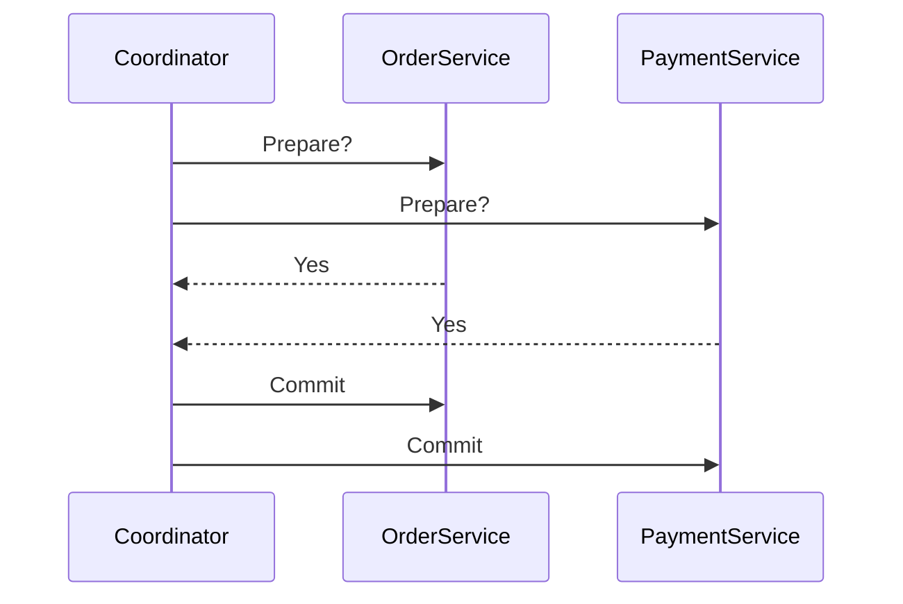
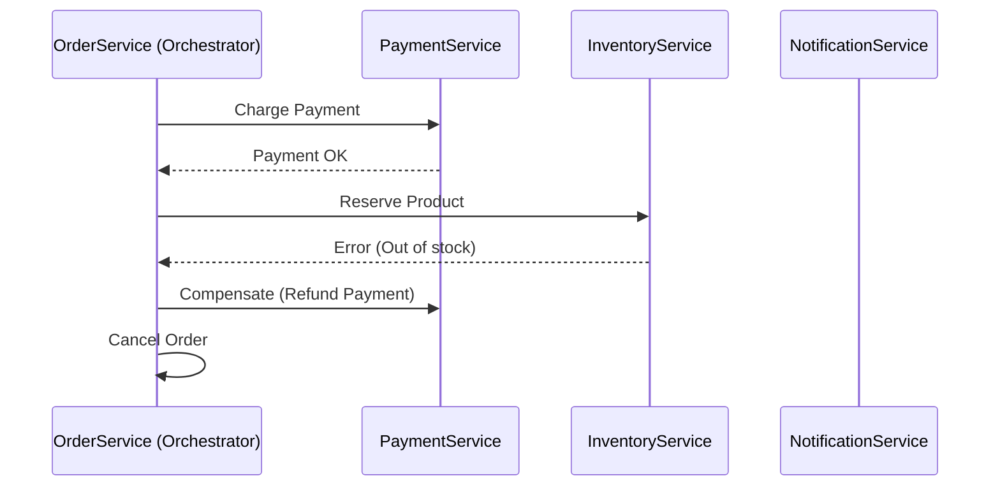
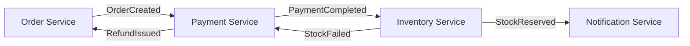
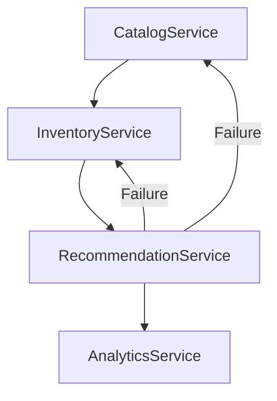
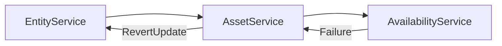

# Distributed Transactions & Sagas

## Overview

In microservices architectures, maintaining **data consistency across multiple services** is a key challenge.  
Traditional transactions (ACID) work well in monoliths, but **don’t scale** when each service owns its own database.  
This README explores how distributed systems achieve consistency using **Sagas**, **compensating actions**, and **idempotency**.

---

## 1. The Problem — Distributed Transactions

In a monolith, a single database transaction guarantees:

- **Atomicity** — all or nothing  
- **Consistency** — valid data  
- **Isolation** — independent transactions  
- **Durability** — persisted data  

But in **microservices**, each service manages its own database, so global transactions are no longer possible.

### Example

| Step | Service | Operation |
|------|----------|------------|
| 1️ | `OrderService` | Create Order |
| 2️ | `PaymentService` | Charge Card |
| 3️ | `InventoryService` | Reserve Item |

If the third step fails, previous steps must be **rolled back manually**.

---

## 2. Why Two-Phase Commit (2PC) Is Not Scalable

**Two-Phase Commit (2PC)** is a coordination protocol ensuring atomicity across distributed systems.

### Phases
1. **Prepare** — the coordinator asks participants if they can commit.  
2. **Commit** — if all agree, coordinator sends commit; otherwise rollback.

### Limitations
- **Blocking:** Participants wait indefinitely if coordinator fails.  
- **Single point of failure:** Coordinator crash halts progress.  
- **Low throughput:** Requires synchronization across systems.  
- **Not cloud-native:** Doesn’t fit event-driven or eventual consistency models.

---

## 3. The Saga Pattern — Distributed Consistency

A **Saga** is a sequence of local transactions, each with a **compensating action** for rollback.

> Instead of one atomic operation, a saga ensures **eventual consistency** through local commits and compensations.

### Example — Product Purchase

| Step | Service | Local Action | Compensation |
|------|----------|---------------|---------------|
| 1️ | `OrderService` | Create Order | Cancel Order |
| 2️ | `PaymentService` | Charge Card | Refund Payment |
| 3️ | `InventoryService` | Reserve Item | Release Item |
| 4️ | `NotificationService` | Send Confirmation | Send Cancellation |

If any step fails, previously completed steps are compensated in reverse order.

---

### Orchestration-Based Saga

A **central coordinator** (the orchestrator) drives the saga and invokes each local transaction step-by-step.

*Used by orchestrators like AWS Step Functions, Temporal.io, or Camunda.*

---

### Choreography-Based Saga

Each service reacts to **events** and emits its own events without a central controller.

*Common in event-driven architectures using Kafka, SNS/SQS, or Kinesis.*

---

## 4. Real-World Example — Product Update Saga

| Step | Service | Action | Compensation |
|------|----------|--------|---------------|
| 1️ | `CatalogService` | Update name/price | Revert to previous version |
| 2️ | `InventoryService` | Adjust stock | Rollback stock count |
| 3️ | `RecommendationService` | Refresh model | Invalidate model |
| 4️ | `AnalyticsService` | Record event | Delete event record |

---

## 5. Idempotency & Deduplication

In distributed systems, duplicate messages are inevitable.  
**Idempotent operations** ensure the same result, even if repeated.

| Operation | Idempotent? | Why |
|------------|-------------|-----|
| `POST /payments` | No | Creates duplicates |
| `PUT /payments/{id}` | Yes | Overwrites same state |
| `PATCH /orders/{id}/status=PAID` | Yes | Safe repeated updates |

### Deduplication Strategies
- Kafka: consumer offset tracking + message keys  
- SQS: FIFO queues with deduplication IDs  
- Application: store processed event IDs in Redis or DynamoDB  

---

## 6. Common Saga Patterns

| Pattern | Description | Example |
|----------|-------------|----------|
| **Orchestration Saga** | Central coordinator | AWS Step Functions |
| **Choreography Saga** | Event-based chain | Kafka / SNS-SQS |
| **Compensation Command** | Rollback via explicit commands | Refund, Cancel, Release |
| **Outbox Pattern** | DB + event publish atomically | Transaction + Kafka |
| **Idempotent Handlers** | Prevent duplicate side effects | Event tracking store |

---

## 7. Real Case — Streaming Asset Network

When a media asset updates:
1. `EntityService` emits `EntityUpdated`  
2. `AssetService` updates metadata  
3. `AvailabilityService` recalculates regions  
4. If step 3 fails → `AssetService` triggers `RevertUpdate`  
5. Saga ensures eventual consistency

---

## 8. Interview Q&A

| Question | Answer |
|-----------|---------|
| Why is 2PC not scalable? | It blocks participants and introduces a single point of failure. |
| What is a Saga? | A series of local transactions coordinated through events or an orchestrator. |
| Difference between Orchestration and Choreography? | Orchestration uses a central controller; Choreography uses event-driven coordination. |
| What is Idempotency? | Ability to process the same event multiple times safely. |
| How do we ensure consistency without ACID? | Use sagas, compensations, and idempotent operations. |

---

## 9. Key Takeaways

- 2PC is **blocking** and **not scalable** for microservices.  
- **Sagas** provide distributed consistency via compensations.  
- **Idempotency** and **deduplication** guarantee reliability.  
- Choose **Orchestration** for controlled workflows; **Choreography** for reactive systems.  
- Combine **Outbox Pattern** and **Event Logs** to ensure delivery guarantees.

---

**This README consolidates all key concepts for Distributed Transactions, 2PC, Sagas, and Idempotency — with real-world relevance to systems like Disney SWAN and FinTech payment pipelines.**