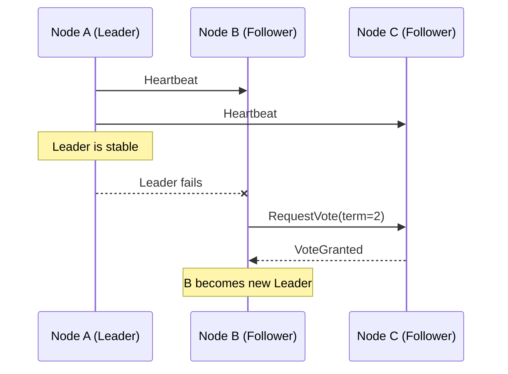
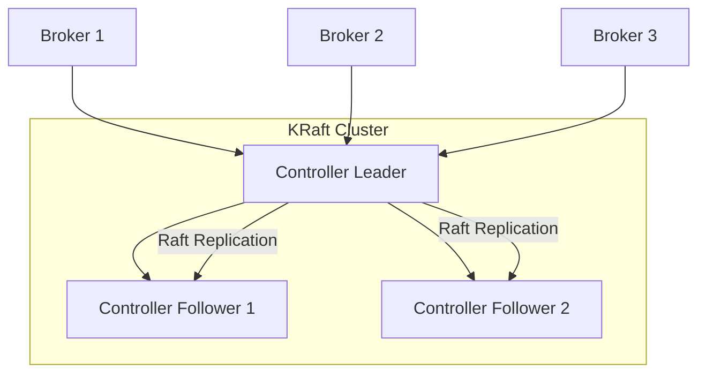

# Leader Election & Coordination

## 1. Overview
Distributed systems need **coordination** to agree on shared state — for example, deciding which node acts as a leader, managing configuration updates, or ensuring that logs are replicated in the correct order.  
Consensus algorithms such as **Paxos** and **Raft** solve this by allowing nodes to **reach agreement even under failures**.

---

## 2. Consensus Problem
In a cluster with multiple nodes:
- Some nodes may crash or become unreachable.
- Messages may arrive late, duplicated, or out of order.

To maintain correctness, all nodes must agree on:
1. **Who is the leader**
2. **What updates have been committed**
3. **What is the latest consistent state**

If multiple nodes believe they are leaders simultaneously, it creates a **split-brain** situation — leading to data corruption or duplicated work.

---

## 3. Consensus Algorithms

### Paxos
Developed by Leslie Lamport, **Paxos** is a mathematically proven algorithm to achieve consensus among unreliable nodes.

Roles:
- **Proposers:** propose a value to be agreed upon.
- **Acceptors:** accept or reject proposals.
- **Learners:** learn the decided value.

**Simplified flow:**
1. A proposer sends a proposal with number *N*.
2. Acceptors promise not to accept proposals with lower *N*.
3. If a majority accepts, the value is chosen.
4. Learners update their state accordingly.

**Pros:**
- Proven correctness and fault tolerance.

**Cons:**
- Difficult to implement.
- Hard to reason about in production environments.

Used by systems such as **Google Chubby** (basis for Zookeeper).

---

### Raft
Introduced in 2013 as a more understandable alternative to Paxos, **Raft** simplifies the mental model while providing equivalent guarantees.

Roles:
- **Leader:** handles all client writes and log replication.
- **Followers:** replicate entries from the leader.
- **Candidates:** start elections when no heartbeat is received.

**Election process:**
1. If a follower doesn’t receive a heartbeat → becomes a candidate.
2. The candidate requests votes from other nodes.
3. If it gains a majority → becomes the leader.
4. The leader sends heartbeats to maintain authority.



**Used in:** etcd, Consul, CockroachDB, Elasticsearch, Kafka (KRaft mode), TiDB.

---

## 4. Leader Election in Practice

### Zookeeper
Zookeeper uses **ZAB (Zookeeper Atomic Broadcast)**, a protocol inspired by Paxos.  
Nodes register ephemeral znodes; the node with the **lowest znode ID** becomes the leader.  
If the leader disconnects, the next lowest znode automatically becomes the new leader.

Used heavily in earlier versions of **Apache Kafka**, **Hadoop**, and **HBase**.

---

### etcd
etcd implements **Raft** for distributed coordination.  
Each configuration change is written to a **replicated Raft log**.  
A majority (quorum) must agree before the change is committed.

Used as the coordination backbone in **Kubernetes** — all cluster state (pods, nodes, deployments) is stored in etcd and synchronized via Raft consensus.

---

## 5. Kafka: Zookeeper vs Raft (KRaft)

Historically, Kafka relied on **Zookeeper** for cluster metadata management and controller election.  
Since Kafka 2.8+, a new **KRaft mode (Kafka + Raft)** replaces Zookeeper with an internal Raft consensus system.

| Feature | Zookeeper Mode | KRaft Mode (Raft) |
|----------|----------------|------------------|
| Coordination | External Zookeeper | Built-in Raft |
| Leader Election | Zookeeper-based | Raft consensus |
| Metadata Storage | znodes | Internal Raft log |
| Complexity | Higher (two systems) | Lower |
| Performance | Slower at scale | Faster |
| Version | Deprecated after 3.5 | Default since 3.7 |

**KRaft architecture:**
- Controllers use Raft to agree on metadata updates.
- Brokers register directly with controllers.
- Metadata (topics, configs, ACLs) is replicated as a Raft log.



**Advantages:**
- Simplifies architecture — no external Zookeeper dependency.
- Faster metadata propagation and leader election.
- Unified storage of state and coordination.
- Easier to operate in containerized environments.

---

## 6. Split-Brain and Quorum Coordination

A **split-brain** happens when network partitions isolate nodes, and each side believes it is the leader.

🧠 **Quorum** prevents this problem:
- Define total replicas: **N**
- Required nodes for write: **W**
- Required nodes for read: **R**

Rule:  
`R + W > N` guarantees that reads always intersect with writes → ensuring consistency.

Example:
```
N = 5, W = 3, R = 3  → strong consistency
N = 5, W = 1, R = 1  → high availability, eventual consistency
```

In Raft, a **majority quorum (>50%)** is required to elect a leader or commit a log entry.

---

## 7. Trade-offs and Summary

| Aspect | Paxos | Raft |
|--------|--------|------|
| Complexity | High | Lower |
| Understandability | Hard | Easier |
| Implementation | Academic | Industry-standard |
| Fault Tolerance | High | High |
| Adoption | Google Chubby, Spanner | etcd, Consul, Kafka KRaft, CockroachDB |

---

## 8. Key Takeaways
- **Consensus** ensures agreement in the presence of failures.
- **Raft** provides a simpler, industry-friendly model for leader election.
- **Quorums** prevent split-brain and data divergence.
- **Kafka’s migration to KRaft** exemplifies modern movement from external coordination (Zookeeper) to internal Raft-based designs.
- Proper leader election underpins availability and consistency in distributed clusters.

---

