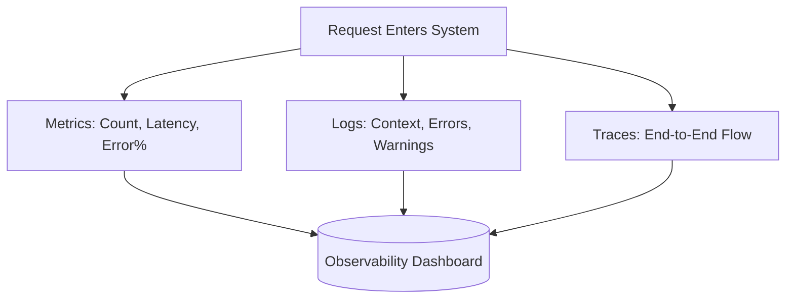
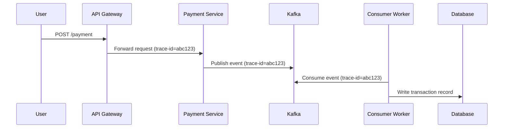
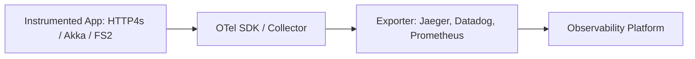
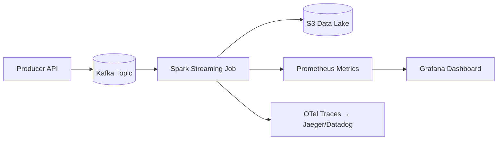

# Observability, Telemetry & Tracing

## Overview

**Observability** is the ability to understand what's happening inside a distributed system through external outputs — specifically **metrics, logs, and traces**.  
In complex architectures (Kafka, SQS, S3, Spark, etc.), observability enables engineers to detect issues, trace failures, and maintain reliability.

---

## The Goal of Observability

> Observability allows you to answer: "What’s broken, where, and why?"

| Question | Example |
|-----------|----------|
| **What’s broken?** | Latency spike in payment API |
| **Why is it broken?** | Kafka consumer slowed down |
| **Where is it broken?** | PaymentWorker in region us-east-1 |

---

## The Three Pillars of Observability

| Pillar | Description | Example |
|---------|--------------|----------|
| **Metrics** | Numeric time-series data | Request latency, CPU usage, Kafka lag |
| **Logs** | Structured/unstructured events | "Payment failed for order 123" |
| **Traces** | End-to-end request paths | API → Kafka → Consumer → DB |

### Relationship Between Metrics, Logs & Traces



All three together provide **360° visibility**.

---

## Tracing End-to-End Requests

Tracing follows a request across multiple services using a unique `trace-id`.



Tools like **Jaeger**, **Datadog**, and **New Relic** visualize this trace.

---

## OpenTelemetry (OTel)

**OpenTelemetry (OTel)** is an open-source framework for generating and exporting telemetry data.

### Architecture


### Scala Example (HTTP4s)
```scala
val builder = OpenTelemetrySdk.builder()
val tracer = builder.build().getTracer("payment-service")

val span = tracer.spanBuilder("processPayment").startSpan()
try {
  // Business logic here
  span.setAttribute("order.id", orderId)
  span.setStatus(StatusCode.OK)
} catch {
  case e: Exception =>
    span.recordException(e)
    span.setStatus(StatusCode.ERROR)
} finally {
  span.end()
}
```

---

## Metrics in Distributed Systems

Metrics quantify **system health** and performance.

| Type | Example | Description |
|------|----------|-------------|
| **Counter** | # of processed payments | Always increases |
| **Gauge** | Kafka consumer lag | Goes up or down |
| **Histogram** | Request latency (p50, p95, p99) | Distribution |
| **Summary** | Aggregated stats | e.g., 95% of requests <200ms |

### Prometheus Example
```yaml
# prometheus.yml
scrape_configs:
  - job_name: 'payment-service'
    static_configs:
      - targets: ['payment-service:9090']
```

```scala
val latencyHistogram = Histogram.build()
  .name("payment_request_latency_seconds")
  .help("Latency of payment requests")
  .register()

val timer = latencyHistogram.startTimer()
processPayment()
timer.observeDuration()
```

---

## Logging Best Practices

Logs should be **structured** and **contextual**, with correlation via `trace_id`.

### sGood Example
```json
{
  "timestamp": "2025-10-10T10:00:00Z",
  "service": "PaymentWorker",
  "trace_id": "abc123",
  "level": "ERROR",
  "message": "Payment failed due to insufficient funds",
  "order_id": 456
}
```

### ❌ Bad Example
```
[ERROR] Payment failed
```

---

## Real-World Example — Monitoring Latency in Ingestion Pipeline

For a streaming system (**Kafka + Spark + S3**):

1. Producer publishes to Kafka topic `raw-events`
2. Spark Structured Streaming consumes events
3. Writes to S3
4. Prometheus scrapes throughput & lag
5. Grafana visualizes latency spikes
6. OpenTelemetry traces producer → Spark → S3



Alerts trigger if latency (`p95 > 2s`) or Kafka lag exceed thresholds.

---

## Interview Q&A

| Question | Answer |
|-----------|---------|
| What are the 3 pillars of observability? | Metrics, logs, and traces. |
| How does tracing differ from logging? | Tracing tracks full request paths, logging records internal events. |
| What is OpenTelemetry? | A vendor-neutral standard for telemetry data collection. |
| Difference between Jaeger and Datadog? | Jaeger is open-source, Datadog is managed. |
| How do you detect latency spikes? | Using p95/p99 metrics and distributed traces. |

---

## Key Takeaways

- **Metrics** quantify performance.
- **Logs** describe events.
- **Traces** reveal end-to-end flow.
- **OpenTelemetry** unifies telemetry data collection.
- Combine **Prometheus + Grafana + Jaeger or only Datadog APM** for full observability.
- Always correlate logs and metrics with a **trace ID** for cross-service debugging.

---

This completes the final topic for **Week 05: Distributed Systems** — giving full visibility into system behavior, reliability, and performance.

---