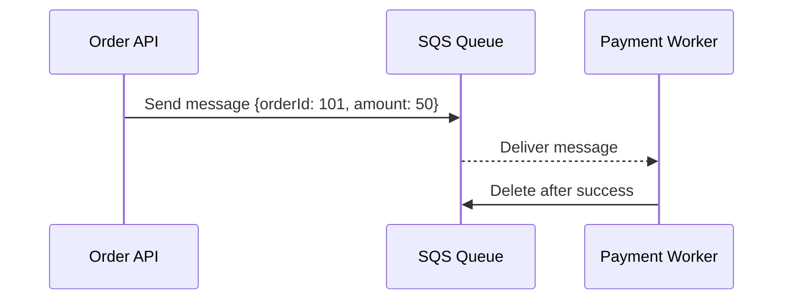
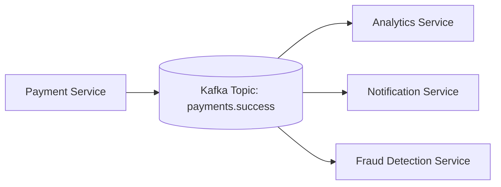
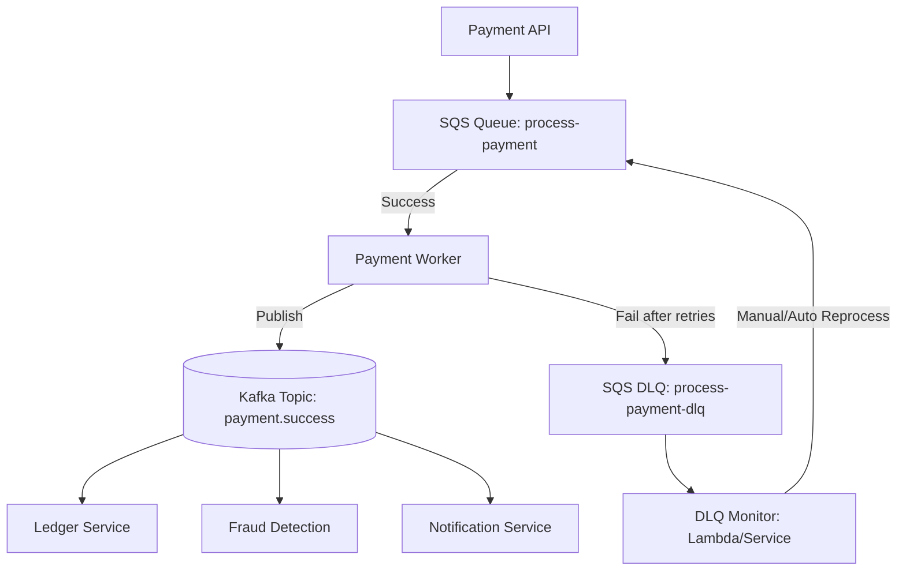
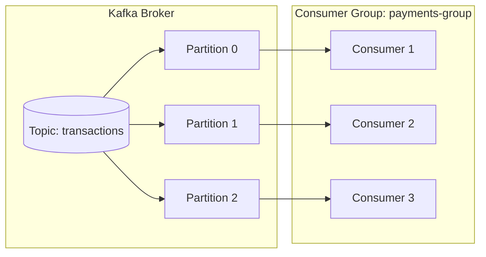
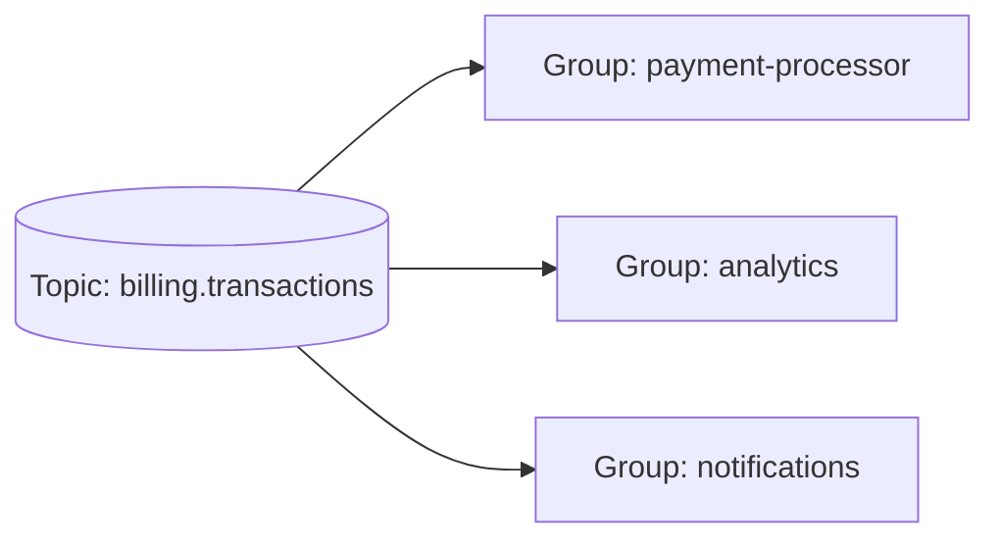
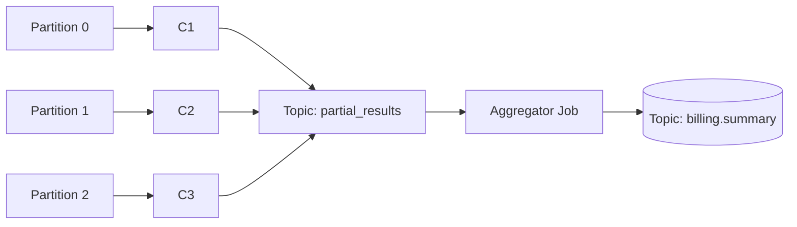
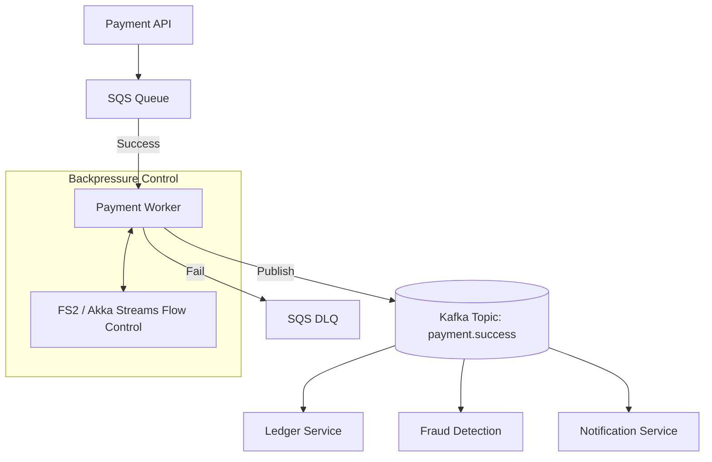

# Queues, Streams & Backpressure

## Overview

This topic explores the difference between **Message Queues** and **Streaming Platforms**, how **Event-Driven Architectures (EDA)** work, how to handle **backpressure**, and how systems combine all these concepts in production.

---

## 1. Queues vs Streams

| Concept | Message Queue | Streaming Platform |
|----------|----------------|--------------------|
| **Examples** | AWS SQS, RabbitMQ | Kafka, Kinesis |
| **Model** | Point-to-point | Publish-subscribe |
| **Delivery** | One consumer per message | Many consumers per event |
| **Retention** | Temporary (deleted after processing) | Persistent (configurable retention) |
| **Replay** | Not possible | Possible (offset-based) |
| **Use Case** | Job processing, asynchronous tasks | Event-driven data flow, analytics |

---

### Example 1 — Message Queue



Used for: job execution, retries, guaranteed once processing.

---

### Example 2 — Streaming Platform



Used for: real-time analytics, event propagation, data pipelines.

---

## 2. Event-Driven Architecture (EDA)

**EDA** is based on the idea that systems communicate through **events**, not direct service calls.

Example:  
1. The Payment Service emits `"payment_success"`.  
2. Analytics updates metrics.  
3. Notifications sends an email.  
4. Fraud Detection monitors transactions.

Each microservice **reacts independently** to the same event.

---

### Combining Queues + Streams in Real Systems

Both coexist in production:

| Stage | Technology | Purpose |
|-------|-------------|----------|
| Job Scheduling | SQS | Reliable message processing and retries |
| Event Broadcasting | Kafka | Notify multiple microservices |
| Storage | DB / S3 | Persist processed data |
| Monitoring | CloudWatch / Datadog | Observability |

---

## 3. Real Example — FinTech Gateway / Payments



**How it works:**
- SQS ensures job reliability and retries.  
- Kafka broadcasts success events to multiple services.  
- DLQ isolates failed messages for later inspection.  
- Monitoring automates recovery or alerting.

---

### AWS Example (SQS + DLQ)

```bash
aws sqs set-queue-attributes \
  --queue-url https://sqs.us-east-1.amazonaws.com/123/process-payment \
  --attributes '{"RedrivePolicy":"{\"maxReceiveCount\":\"5\", \"deadLetterTargetArn\":\"arn:aws:sqs:us-east-1:123:process-payment-dlq\"}"}'
```

After 5 failed attempts, messages move automatically to `process-payment-dlq`.

---

## 4. Kafka vs Kinesis

| Concept | Kafka | Kinesis |
|----------|--------|----------|
| **Type** | Open-source distributed log | Managed AWS service |
| **Structure** | Topic → Partition → Offset | Stream → Shard → Sequence Number |
| **Scaling** | Manual partitioning | Auto or manual shard scaling |
| **Retention** | Configurable | Up to 1 year |
| **Replay** | Full offset control | Shard iterator checkpoint |
| **Ecosystem** | Zookeeper, Schema Registry, Connect | Glue, Firehose, Lambda, CloudWatch |

Both are **event streaming** systems, but Kinesis offloads cluster management to AWS.

---

## 5. Kafka Consumer Groups

A **Consumer Group** is a set of consumers that share the work of reading from a topic.



**Rules:**
- Each partition → exactly one consumer per group.  
- Consumers in the same group = instances of the same service.  
- Different services use different groups to read the same topic.

---

### Multi-Service Example



Each group reads independently and keeps its own offsets.

---

## 6. Backpressure Management

**Backpressure** occurs when producers send data faster than consumers can process.

### Techniques to handle it:
- Use bounded buffers and queues.
- Implement flow control (pause/resume).
- Apply rate limiting and batching.
- Use streaming libraries like **FS2** or **Akka Streams** which are natively *backpressure-aware*.

---

### FS2 Example

```scala
val stream =
  KafkaConsumer.stream(settings)
    .subscribeTo("transactions")
    .records
    .evalMap { record =>
      IO.println(s"Processing: ${record.record.value}") >>
      record.offset.commit
    }
```

FS2 pulls messages lazily — preventing overload.

---

### Akka Streams Example

```scala
Consumer
  .plainSource(consumerSettings, Subscriptions.topics("transactions"))
  .map(_.value)
  .map { msg =>
    println(s"Processing: $msg")
    msg
  }
  .runWith(Sink.ignore)
```

Built-in backpressure: downstream slow → upstream slows automatically.

---

## 7. Event Processing & Aggregation

Each consumer reads its assigned partitions independently.  
Aggregation happens later through new topics or external jobs (e.g., Spark, Flink).



---

## 8. Interview Q&A

| Question | Answer |
|-----------|---------|
| **What’s the difference between SQS and Kafka?** | SQS is a reliable job queue (one message, one worker). Kafka is a distributed log (one message, many consumers). |
| **What’s a DLQ?** | A Dead Letter Queue stores messages that failed after multiple retries. |
| **What’s backpressure?** | A mechanism that slows producers when consumers are overloaded. |
| **Why are consumer groups important?** | They enable scaling and parallelism for a single service while maintaining message order. |
| **How would you combine SQS and Kafka?** | Use SQS for reliable job execution, Kafka for event propagation to multiple systems. |

---

## 9. Key Takeaways

- **Queues** handle reliability and retries.  
- **Streams** handle scalability and multi-consumer event propagation.  
- **Backpressure** ensures system stability.  
- **DLQs** guarantee no data loss.  
- **Consumer Groups** provide controlled parallelism.  
- **Event-driven architectures** power modern financial systems.

---

## 10. Real-World Architecture Summary



---

**This README consolidates the full study of Queues, Streams, Backpressure, DLQs, Kafka Consumer Groups, and their real-world applications in distributed financial systems.**