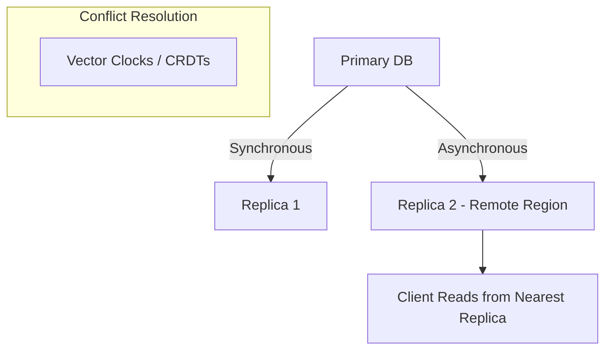
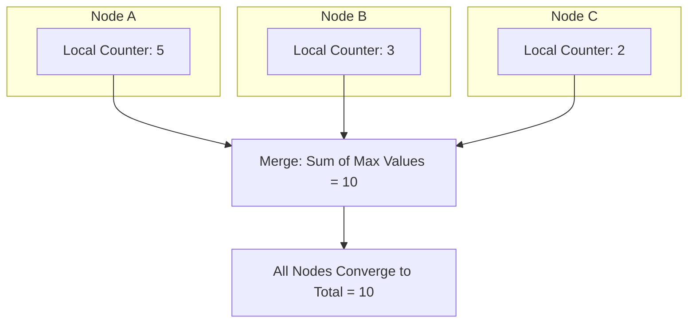

# Replication Strategies

## Overview
Replication is the process of maintaining multiple copies of the same data across different nodes or regions.  
It improves **availability**, **fault tolerance**, and **read scalability**, but introduces challenges in consistency and coordination.

---

## Synchronous vs Asynchronous Replication

### Synchronous Replication
- A write operation is confirmed **only after** all replicas (or a quorum) have persisted the update.  
- Guarantees **strong consistency**, but increases **latency** and reduces availability under failures.

| Property | Description |
|-----------|--------------|
| Consistency | Strong |
| Latency | Higher |
| Availability | Lower (waits for replicas) |
| Data Loss | Minimal |
| Example | Banking systems, ledgers |

**Example:**  
When updating `asset_status = "READY"`, the primary waits until replicas also write this value before responding `OK`.

---

### Asynchronous Replication
- The primary acknowledges the write **immediately**, while updates propagate to replicas later.  
- Guarantees **eventual consistency**.  
- Offers low latency but risks **temporary data divergence** or **loss** if the primary fails before replication completes.

| Property | Description |
|-----------|--------------|
| Consistency | Eventual |
| Latency | Lower |
| Availability | Higher |
| Data Loss | Possible during failure |
| Example | Content delivery, caches, streaming metadata |

**Example:**  
A content update in Disney and the content service is accepted instantly and replicated asynchronously across data centers to maintain fast user experience.

---

### Comparison Summary

| Aspect | Synchronous | Asynchronous |
|--------|--------------|--------------|
| Read freshness | Always up-to-date | May be stale |
| Write throughput | Lower | Higher |
| Typical systems | PostgreSQL synchronous mode, etcd | Cassandra, DynamoDB |

---

## Geo-Replication (Multi-Region Systems)
Geo-replication distributes data across regions (e.g., US-East, EU-West, AP-South) to:
- Reduce **latency** by serving users from the nearest replica.
- Provide **disaster recovery** if one region fails.
- Handle **regulatory compliance** for data locality.

**Example:**  
A global asset registry in media service replicates media metadata across Virginia, Ireland, and Singapore regions.  
If one region goes offline, reads and writes redirect to another active region.

**Challenges:**
- Cross-region network latency.
- Clock skew across data centers.
- Conflict resolution when updates happen concurrently.

---

## Conflict Resolution Mechanisms

### a. Last Write Wins (LWW)
- Each update carries a timestamp.  
- The system keeps the most recent one.  
- Simple but depends on synchronized clocks.

```scala
if (update1.timestamp > update2.timestamp) use(update1)
else use(update2)
```

**Example:**  
`asset_state=READY@t=100` vs `asset_state=PENDING@t=120` → `PENDING` wins.

---

### b. Vector Clocks
- Each node tracks counters for itself and others.  
- When merging, it can detect whether one update **happened-before** another or if they are **concurrent**.

```
NodeA: {A:2, B:0}
NodeB: {A:1, B:1}
→ Conflict detected: updates are concurrent.
```

**Usage:** Detect and resolve concurrent updates (used in Dynamo, Riak).

---

### c. CRDTs (Conflict-free Replicated Data Types)
CRDTs are mathematical data types that converge automatically without coordination.  
They ensure deterministic merges even under concurrent updates.

| Type | Description | Example Use Case |
|------|--------------|------------------|
| **G-Counter** | Grow-only counter (increments only) | Likes, page views |
| **PN-Counter** | Positive & negative counter | Inventory, stock |
| **G-Set** | Grow-only set | Event logs |
| **2P-Set** | Add/remove once | Unique session tracking |
| **OR-Set** | Add/remove multiple times safely | Shared lists, shopping carts |
| **LWW-Register** | Keeps latest write by timestamp | Asset state updates |
| **MV-Register** | Keeps multiple concurrent values | Versioned data requiring merge |

**Example – G-Counter (Grow-only Counter):**
Each node maintains its own counter.  
The global total is the sum of the **maximum values** per node after synchronization.

| Node | Local Counter |
|-------|----------------|
| A | 5 |
| B | 3 |
| C | 2 |

After synchronization:
```
A: {A→5, B→3, C→2}
B: {A→5, B→3, C→2}
C: {A→5, B→3, C→2}
Total = 10
```

When A increments by +1 and syncs again:
```
A: {A→6, B→3, C→2} → Total = 11
```
All replicas converge deterministically.

---

## Trade-offs: Durability vs Availability

Replication improves durability but requires coordination, impacting availability and latency.

- More replicas = higher durability, higher coordination cost.
- Quorum-based systems balance trade-offs:
  - **Write quorum (W)** = number of replicas that must acknowledge a write.
  - **Read quorum (R)** = number of replicas required for a valid read.
  - **Rule:** `R + W > N` ensures consistency.

**Example:**
```
N = 3, W = 2, R = 2 → strong consistency
N = 3, W = 1, R = 1 → high availability, eventual consistency
```

---

## Mermaid Diagrams

### Replication Topology


### G-Counter Synchronization


---

## Key Takeaways
- **Synchronous replication** ensures strong consistency but adds latency.  
- **Asynchronous replication** favors low latency and high availability.  
- **Geo-replication** provides resilience across regions.  
- **Conflict resolution** (LWW, vector clocks, CRDTs) ensures deterministic convergence.  
- **Durability vs availability** is an adjustable trade-off via quorum configuration.

---