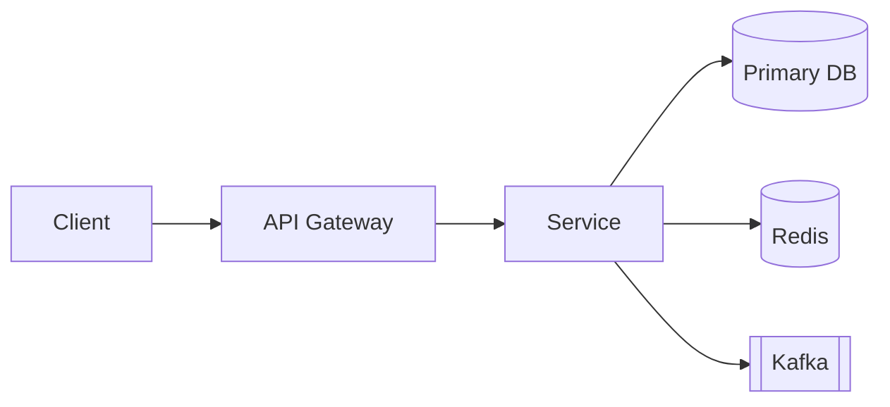

# <System Name>
**Date:** <YYYY-MM-DD>  
**Author:** Ernesto Chero

## 1. Requirements
### 1.1 Functional
- [ ] …
### 1.2 Non-Functional
- [ ] Latency SLA: …
- [ ] Availability: …
- [ ] Throughput: …
- [ ] Storage growth: …

## 2. High-Level Architecture

**Notes:** rationale for components, boundaries, contracts.

## 3. Data Model & Storage
- Entities, relationships, indexes, partitioning/sharding.
- Consistency model & transactions (ACID vs eventual, Saga).

## 4. Workflows
- Read/write flows with sequence diagrams or step lists.

## 5. Scaling & Resilience
- Caching, replication, sharding.
- Backpressure, retries, circuit breakers, rate limits.

## 6. Observability & Ops
- Metrics, logs, tracing, SLOs, alerting, dashboards.

## 7. Security & Privacy
- AuthN/AuthZ, data encryption, secrets, compliance (PCI/GDPR).

## 8. Risks & Trade-offs
- What I chose, what I rejected, unknowns.

## 9. Stepwise Evolution
- MVP -> v2 -> v3 roadmap.

## 10. Appendix
- Capacity planning, rough sizing, formulas.
